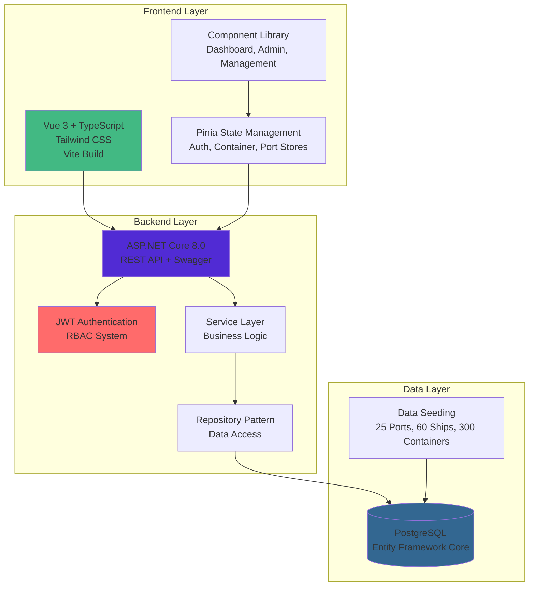

# 🚢 PortTrack Container Operations System

A comprehensive **Full-Stack Application** for managing container tracking and port operations with **Real-Time Monitoring**, **Role-Based Access Control (RBAC)**, and **Modern Web Technologies**.

## 🌟 Overview

**PortTrack** is an enterprise-grade maritime operations platform that provides real-time visibility into container tracking, ship management, and port operations. Built with modern technologies and designed for scalability, it serves ports, shipping companies, and logistics providers worldwide.

## ✨ Key Features

### 🔐 Authentication & Security
- **JWT Authentication** with secure token management
- **4-Tier Role System**: Admin, Port Manager, Operator, Viewer
- **21 Granular Permissions** across container, ship, port, and cargo operations
- **Role Application System** with approval workflows
- **Session Management** with automatic token refresh

### 📦 Core Operations
- **Container Management** - Track 300+ containers across 25 global ports with real-time status monitoring
- **Ship Operations** - Manage 60+ ships from major shipping lines (Maersk, MSC, COSCO, Evergreen)
- **Port Management** - Multi-port support across 6 continents with automated berth allocation
- **Berth Assignment** - Smart scheduling with 120+ berth assignments
- **Event Streaming** - Real-time operational updates and notifications

### 🌍 Enhanced Business Data
- **25 Major World Ports** - Copenhagen, Shanghai, Los Angeles, Dubai, Rotterdam, and more
- **60+ Real Ships** - Fleet from Maersk, MSC, COSCO, Evergreen, HMM, OOCL, CMA CGM
- **300 Diverse Containers** - 8 container types, 10+ cargo categories, 12 status types
- **120+ Berth Operations** - Realistic assignment timelines and capacity management

### 🛠️ Technology Stack

#### **Backend (ASP.NET Core 8.0)**
- **Web API**: RESTful API with Swagger/OpenAPI documentation
- **Database**: PostgreSQL with Entity Framework Core
- **Authentication**: JWT tokens with custom authorization attributes
- **Architecture**: Repository pattern with service layer
- **Testing**: Comprehensive Postman collections and unit tests

#### **Frontend (Vue 3 + TypeScript)**
- **Framework**: Vue 3.5.22 with Composition API and TypeScript
- **Build Tool**: Vite 7.1.7 with hot module replacement
- **Styling**: Tailwind CSS 4.1.13 with responsive design
- **State Management**: Pinia stores for reactive state management
- **Icons**: Lucide Vue Next for modern iconography
- **HTTP Client**: Axios with interceptors and error handling

## 🚀 Quick Start

### Prerequisites
- **.NET 8.0 SDK** - For backend development
- **Node.js 20.19.0+** - For frontend development  
- **PostgreSQL** - Database server
- **Git** - Version control
- **VS Code** - Recommended IDE with extensions

### Backend Setup
```bash
# Navigate to backend directory
cd backend

# Restore dependencies
dotnet restore

# Update database connection string in appsettings.json
# Run database migrations
dotnet ef database update

# Start the API server
dotnet run
# API available at: http://localhost:5221
# Swagger UI: http://localhost:5221/swagger
```

### Frontend Setup
```bash
# Navigate to frontend directory
cd frontend

# Install dependencies
npm install

# Configure environment variables
cp .env.production.example .env
# Update API_BASE_URL in .env file

# Start development server
npm run dev
# Frontend available at: http://localhost:5173
```

### Full System Setup
```bash
# Clone repository
git clone https://github.com/kalviumcommunity/Container-Tracking-and-Port-Operations-Maersk-Hackathon.git
cd Container-Tracking-and-Port-Operations-Maersk-Hackathon

# Start backend (Terminal 1)
cd backend && dotnet run

# Start frontend (Terminal 2) 
cd frontend && npm run dev
```

### Default Login Credentials
- **Username**: `admin`
- **Password**: `Admin123!`
- **Access Level**: Full system administration

## 📋 Documentation Index

### 📖 **General Documentation**
- [**System Overview**](./docs/SYSTEM-OVERVIEW.md) - Complete technical system documentation
- [**Project Overview**](./docs/project-overview.md) - High-level project information
- [**Documentation Index**](./docs/DOCUMENTATION-INDEX.md) - Complete documentation catalog

### 🖥️ **Backend Documentation**
- [**API Specification**](./docs/backend/api-specification.md) - Complete REST API reference
- [**Authentication Guide**](./docs/backend/authentication-guide.md) - JWT and RBAC implementation
- [**Database Schema**](./docs/backend/database-entity-relationships.md) - ERD and table relationships
- [**Development Setup**](./docs/backend/development-setup-guide.md) - Backend development environment
- [**Architecture Overview**](./docs/backend/architecture-overview.md) - Backend system design
- [**Testing Guide**](./docs/backend/testing_guide.md) - API testing strategies
- [**JWT Testing Guide**](./docs/backend/JWT-TESTING-GUIDE.md) - Authentication testing examples
- [**Azure Deployment**](./docs/backend/AZURE-DEPLOYMENT-SECURITY-GUIDE.md) - Production deployment guide
- [**Enhanced Seeding**](./docs/backend/ENHANCED-SEEDING-GUIDE.md) - Database seeding documentation

### 🎨 **Frontend Documentation**
- [**Frontend Setup Guide**](./docs/frontend/frontend-setup-guide.md) - Complete Vue 3 development setup
- [**Component Development**](./docs/frontend/component-development-guide.md) - Vue component standards and patterns
- [**Frontend Architecture**](./docs/frontend/frontend-architecture.md) - Technical architecture and structure
- [**API Integration Guide**](./docs/frontend/api-integration-guide.md) - Axios services and HTTP communication
- [**UI Wireframes**](./docs/frontend/ui-wireframes.md) - Design mockups and interface documentation

### 🔧 **Development Resources**
- **Postman Collections**: 
  - [API Collection](./docs/backend/Container-Tracking-API.postman_collection.json)
  - [Auth Collection](./docs/backend/Container-Tracking-API-Auth.postman_collection.json)
- **Test Scripts**: 
  - PowerShell: `scripts/test-auth.ps1`
  - Bash: `scripts/test-auth.sh`
- **Change Log**: [CHANGELOG.md](./docs/CHANGELOG.md)

## 👥 User Roles & Permissions

| Role | Access Level | Key Permissions | Frontend Access |
|------|-------------|-----------------|-----------------|
| **Admin** | Full System | All 21 permissions, user management, system configuration | All components + Admin Dashboard |
| **Port Manager** | Port Operations | Manage ships, containers, berths, port operations | Management dashboards + Operations |
| **Operator** | Daily Operations | Container/cargo operations, berth assignments | Operational components + Basic dashboard |
| **Viewer** | Read Only | View all data, generate reports | Dashboard + Read-only views |

### Permission Categories
- **Container Operations**: Create, Read, Update, Delete containers
- **Ship Management**: Ship operations, container assignments
- **Port Operations**: Berth management, port configuration
- **User Administration**: User creation, role assignments (Admin only)
- **System Configuration**: Global settings, data seeding (Admin only)

## 🧪 Testing & Development

### Authentication Testing

#### **Option 1: Postman Collections (Recommended)**
```bash
# Import collections from docs/backend/
1. Container-Tracking-API-Auth.postman_collection.json
2. Container-Tracking-API.postman_collection.json

# Run "Login (Admin)" request
# JWT token auto-saved for subsequent requests
```

#### **Option 2: Quick Test Scripts**
```bash
# PowerShell
./scripts/test-auth.ps1

# Bash/Linux
./scripts/test-auth.sh
```

#### **Option 3: Manual cURL**
```bash
# Get JWT token
curl -X POST "http://localhost:5221/api/auth/login" \
  -H "Content-Type: application/json" \
  -d '{"username":"admin","password":"Admin123!"}'

# Use token in subsequent requests
curl -X GET "http://localhost:5221/api/containers" \
  -H "Authorization: Bearer YOUR_JWT_TOKEN"
```

### Frontend Development
```bash
# Start development server with hot reload
npm run dev

# Build for production
npm run build

# Preview production build
npm run preview

# Type checking (TypeScript)
npm run type-check
```

### Backend Development
```bash
# Run with file watching
dotnet watch run

# Run tests
dotnet test

# Database migrations
dotnet ef migrations add MigrationName
dotnet ef database update
```

## 🏗️ System Architecture

### High-Level Architecture


### Project Structure
```
PortTrack Container Operations/
├── 📁 backend/                    # ASP.NET Core Web API
│   ├── Controllers/               # API endpoints (10 controllers)
│   ├── Models/                    # Entity models (15+ models)
│   ├── Services/                  # Business logic (11 services)
│   ├── Repositories/              # Data access (9 repositories)
│   ├── DTOs/                      # Data transfer objects
│   ├── Middleware/                # Custom middleware
│   ├── Extensions/                # Service extensions
│   └── Migrations/                # Database migrations
├── 📁 frontend/                   # Vue 3 + TypeScript SPA
│   ├── src/
│   │   ├── components/            # Vue components (12+ components)
│   │   ├── stores/                # Pinia state management
│   │   ├── services/              # API services
│   │   ├── router/                # Vue Router configuration
│   │   ├── forms/                 # Form components
│   │   └── assets/                # Static assets
│   ├── public/                    # Public assets
│   └── dist/                      # Build output
├── 📁 docs/                       # Comprehensive documentation
│   ├── backend/                   # Backend-specific docs
│   ├── frontend/                  # Frontend-specific docs
│   ├── SYSTEM-OVERVIEW.md         # Complete technical overview
│   └── README.md                  # Documentation index
└── 📁 scripts/                    # Utility scripts
    ├── test-auth.ps1              # PowerShell auth testing
    └── test-auth.sh               # Bash auth testing
```

## 🔗 API Endpoints Overview

### **Authentication Endpoints**
- `POST /api/auth/login` - User authentication
- `POST /api/auth/register` - User registration (Admin only)
- `POST /api/auth/refresh` - Token refresh
- `GET /api/auth/profile` - User profile

### **Core Business Endpoints**
- `GET|POST|PUT|DELETE /api/containers` - Container operations
- `GET|POST|PUT|DELETE /api/ships` - Ship management
- `GET|POST|PUT|DELETE /api/ports` - Port operations
- `GET|POST|PUT|DELETE /api/berths` - Berth management

### **Administrative Endpoints**
- `GET|POST|PUT|DELETE /api/users` - User management
- `GET|POST|PATCH /api/role-applications` - Role request system
- `POST /api/seed` - Database seeding operations

### **Real-Time Features**
- WebSocket support for live updates
- Event streaming for operational changes
- Real-time dashboard metrics

## 🚀 Deployment & Production

### Development Environment
```bash
# Backend: http://localhost:5221
# Frontend: http://localhost:5173
# Database: PostgreSQL (local or Azure)
```

### Production Deployment
- **Backend**: Azure App Service with PostgreSQL Flexible Server
- **Frontend**: Azure Static Web Apps or Netlify
- **Database**: Azure Database for PostgreSQL
- **CI/CD**: GitHub Actions for automated deployment

### Environment Configuration
```bash
# Backend (.env / appsettings.json)
ConnectionStrings__DefaultConnection=...
JWT__SecretKey=...
JWT__Issuer=...
JWT__Audience=...

# Frontend (.env)
VITE_API_BASE_URL=https://api.porttrack.com
VITE_APP_TITLE=PortTrack Container Operations
```

## � Development Workflow

### Setting Up Development Environment

#### **1. Initial Setup**
```bash
# Clone and navigate
git clone https://github.com/kalviumcommunity/Container-Tracking-and-Port-Operations-Maersk-Hackathon.git
cd Container-Tracking-and-Port-Operations-Maersk-Hackathon

# Install global tools
dotnet tool install --global dotnet-ef
npm install -g @vue/cli
```

#### **2. Backend Development**
```bash
cd backend

# Setup database
dotnet ef database update

# Start development with auto-reload
dotnet watch run

# Available at: http://localhost:5221
# Swagger UI: http://localhost:5221/swagger
```

#### **3. Frontend Development**
```bash
cd frontend

# Install dependencies
npm install

# Start development server
npm run dev

# Available at: http://localhost:5173
```

### Code Quality & Standards

#### **Backend (.NET)**
- Follow Repository Pattern with Service Layer
- Use DTOs for API communication
- Implement proper error handling and logging
- Apply SOLID principles and dependency injection
- Write unit tests for services and controllers

#### **Frontend (Vue 3)**
- Use Composition API with TypeScript
- Follow component-based architecture
- Implement Pinia for state management
- Use Tailwind CSS for styling
- Maintain responsive design principles

### Git Workflow
```bash
# Create feature branch
git checkout -b feature/new-functionality

# Make changes and test locally
# Commit with descriptive messages
git add .
git commit -m "feat: add container tracking dashboard"

# Push and create PR
git push origin feature/new-functionality
```

## 🔒 Security & Best Practices

### Authentication Security
- **JWT Tokens**: Secure token-based authentication
- **Role-Based Access**: Granular permission system
- **Password Policy**: Strong password requirements
- **Session Management**: Automatic token refresh and expiration
- **API Security**: HTTPS, CORS, and input validation

### Development Security
- **Environment Variables**: Secure configuration management
- **Connection Strings**: Encrypted database connections
- **API Keys**: Secure external service integration
- **Input Validation**: Server-side and client-side validation
- **Error Handling**: Secure error messages without data exposure

## 📊 Features & Capabilities

### **Dashboard Features**
- **Real-Time Monitoring**: Live container and ship status updates
- **Performance Metrics**: Port efficiency and operational KPIs
- **Interactive Charts**: Visual data representation with charts
- **Role-Based Views**: Customized dashboard per user role
- **Notification System**: Real-time alerts and notifications

### **Container Management**
- **Container Tracking**: Real-time location and status monitoring
- **Inventory Management**: Container types, cargo, and capacity tracking
- **Status Updates**: Automated status transitions and manual updates
- **Search & Filtering**: Advanced search with multiple criteria
- **Bulk Operations**: Mass updates and operations

### **Ship Operations**
- **Fleet Management**: Ship registration and details management
- **Container Assignment**: Ship-to-container relationship management
- **Berth Scheduling**: Automated berth assignment and scheduling
- **Arrival/Departure**: Ship movement tracking and notifications
- **Capacity Planning**: Ship capacity and utilization monitoring

### **Port Management**
- **Multi-Port Support**: Global port network management
- **Berth Management**: Berth allocation and utilization tracking
- **Operational Planning**: Resource allocation and scheduling
- **Performance Analytics**: Port efficiency and throughput metrics
- **Reporting**: Comprehensive operational reports

## 🛠️ Technical Specifications

### **Backend Technical Details**
- **Framework**: ASP.NET Core 8.0 Web API
- **Database**: PostgreSQL with Entity Framework Core 8.0
- **Architecture**: Clean Architecture with Repository Pattern
- **Authentication**: JWT Bearer tokens with RBAC
- **Documentation**: Swagger/OpenAPI 3.0
- **Logging**: Structured logging with Serilog
- **Testing**: xUnit for unit and integration tests

### **Frontend Technical Details**
- **Framework**: Vue 3.5.22 with Composition API
- **Language**: TypeScript for type safety
- **Build Tool**: Vite 7.1.7 with HMR and optimization
- **Styling**: Tailwind CSS 4.1.13 with custom components
- **State Management**: Pinia for reactive state management
- **HTTP Client**: Axios with interceptors and error handling
- **Icons**: Lucide Vue Next for consistent iconography
- **Testing**: Vitest for unit testing (when configured)

### **Database Schema**
- **15+ Entity Models**: User, Role, Container, Ship, Port, Berth, etc.
- **Relationships**: Properly defined foreign keys and navigation properties
- **Indexes**: Optimized database indexes for performance
- **Migrations**: Version-controlled database schema changes
- **Seeding**: Comprehensive test data with realistic scenarios

## 🚀 Getting Started Checklist

### **For Developers**
- [ ] Clone repository and install dependencies
- [ ] Set up PostgreSQL database and run migrations
- [ ] Configure environment variables for both backend and frontend
- [ ] Start backend API and verify Swagger UI access
- [ ] Start frontend development server
- [ ] Test authentication with default admin credentials
- [ ] Explore API endpoints using Postman collections
- [ ] Review documentation in the `docs/` folder

### **For System Administrators**
- [ ] Review security settings and update default passwords
- [ ] Configure production database connections
- [ ] Set up proper logging and monitoring
- [ ] Configure HTTPS and SSL certificates
- [ ] Review and adjust CORS settings
- [ ] Set up backup and disaster recovery procedures
- [ ] Configure user roles and permissions

### **For Business Users**
- [ ] Create user accounts with appropriate roles
- [ ] Import initial business data (ports, ships, containers)
- [ ] Configure operational workflows
- [ ] Set up notification preferences
- [ ] Train users on dashboard features
- [ ] Establish data validation and quality procedures

---

## 🎯 Next Steps

1. **🔐 Test Authentication**: Use Postman collections or testing scripts to verify login functionality
2. **📊 Explore Dashboard**: Access the frontend application and navigate through different role-based views
3. **📖 Read Documentation**: Review the comprehensive documentation in the `docs/` folder
4. **🔧 Customize Configuration**: Update settings, connection strings, and business-specific data
5. **👥 Create Users**: Add team members with appropriate roles and permissions
6. **🚀 Deploy to Production**: Follow deployment guides for production environment setup

---

**� Ready to set sail with PortTrack?** Start with the [System Overview](./docs/SYSTEM-OVERVIEW.md) for complete technical documentation, or jump into development with our [setup guides](./docs/backend/development-setup-guide.md)!

---

## 📞 Support & Contributing

- **Documentation**: Comprehensive guides in `/docs` folder
- **Issues**: Report bugs and feature requests via GitHub Issues  
- **Contributing**: Follow the development workflow and coding standards
- **License**: MIT License - see LICENSE file for details

**Built with ❤️ for the maritime industry** 🌊