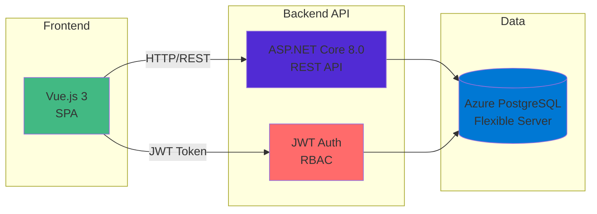

# 🚢 Container Tracking & Port Operations System

A comprehensive **ASP.NET Core Web API** for managing container tracking and port operations with **Role-Based Access Control (RBAC)** and **JWT Authentication**.

## ✨ Key Features

### 🔐 Authentication & Security
- **JWT Authentication** with role-based access control
- **4 User Roles**: Admin, Port Manager, Operator, Viewer
- **21 Granular Permissions** across container, ship, port, and cargo operations
- **Default Admin Account**: `admin` / `Admin123!`

### 📦 Core Operations
- **Container Management** - Track 300+ containers across 25 global ports with real-time status monitoring
- **Ship Operations** - Manage 60+ ships from major shipping lines (Maersk, MSC, COSCO, Evergreen)
- **Port Management** - Multi-port support across 6 continents with automated berth allocation
- **Berth Assignment** - Smart scheduling with 120+ berth assignments

### 🌍 Enhanced Business Data
- **25 Major World Ports** - Copenhagen, Shanghai, Los Angeles, Dubai, Rotterdam, and more
- **60+ Real Ships** - Fleet from Maersk, MSC, COSCO, Evergreen, HMM, OOCL, CMA CGM
- **300 Diverse Containers** - 8 container types, 10+ cargo categories, 12 status types
- **120+ Berth Operations** - Realistic assignment timelines and capacity management

### 🛠 Technical Stack
- **Backend**: ASP.NET Core 8.0 Web API
- **Database**: PostgreSQL with Entity Framework Core
- **Authentication**: JWT tokens with custom authorization attributes
- **Documentation**: Swagger/OpenAPI integration
- **Testing**: Comprehensive Postman collections

## 🚀 Quick Start

### Prerequisites
- .NET 8.0 SDK
- PostgreSQL database
- Git

### Setup & Run
```bash
# Clone repository
git clone https://github.com/kalviumcommunity/Container-Tracking-and-Port-Operations-Maersk-Hackathon.git
cd Container-Tracking-and-Port-Operations-Maersk-Hackathon

# Configure database (update connection string in backend/appsettings.json)
cd backend
dotnet restore
dotnet ef database update

# Run the API
dotnet run
```

### Access Points
- **API**: http://localhost:5221
- **Swagger UI**: http://localhost:5221/swagger
- **Login**: Username: `admin`, Password: `Admin123!`

## 🧪 Testing Authentication

### Option 1: Postman (Recommended)
1. Import: `docs/Container-Tracking-API-Auth.postman_collection.json`
2. Run "Login (Admin)" request
3. JWT token auto-saved for all requests

### Option 2: Quick Test Script
```powershell
# PowerShell
./scripts/test-auth.ps1
```

### Option 3: Manual cURL
```bash
# Get JWT token
curl -X POST "http://localhost:5221/api/auth/login" \
  -H "Content-Type: application/json" \
  -d '{"username":"admin","password":"Admin123!"}'
```

## 👥 User Roles & Permissions

| Role | Access Level | Key Permissions |
|------|-------------|-----------------|
| **Admin** | Full System | All permissions, user management |
| **Port Manager** | Port Operations | Manage ships, containers, berths |
| **Operator** | Daily Operations | Container/cargo operations |
| **Viewer** | Read Only | View all data, reports |

## 📚 Documentation

### Essential Guides
- **[🔐 JWT Testing Guide](JWT-TESTING-GUIDE.md)** - Complete authentication testing with examples
- **[Authentication Guide](docs/authentication-guide.md)** - Full RBAC documentation
- **[API Documentation](docs/api-specification.md)** - Complete endpoint reference

### Development Resources
- [Database Schema](docs/database-entity-relationships.md) - ERD and relationships
- [Architecture Overview](docs/architecture-overview.md) - System design
- [Development Setup](docs/development-setup-guide.md) - Detailed setup guide
- [Testing Guide](docs/testing_guide.md) - API testing strategies

### Quick Resources
- **Postman Collections**: `docs/Container-Tracking-API-Auth.postman_collection.json`
- **Test Scripts**: `scripts/test-auth.ps1` | `scripts/test-auth.sh`
- **Project Status**: [CHANGELOG.md](docs/CHANGELOG.md)

## 🏗 Project Structure



### Folder Structure
```
├── backend/                 # ASP.NET Core Web API
├── frontend/               # Vue.js Frontend (in development)
├── docs/                   # Complete documentation
├── scripts/                # Testing and utility scripts
└── JWT-TESTING-GUIDE.md   # Quick authentication reference
```

## 🔗 Live API Endpoints

### Public
- `GET /api/health` - Health check

### Authentication Required
- `GET /api/containers` - List containers
- `GET /api/ships` - List ships  
- `GET /api/ports` - List ports
- `POST /api/containers` - Create container (requires permissions)

### Admin Only
- `GET /api/auth/users` - List users
- `POST /api/auth/register` - Create user

## 🚀 Next Steps

1. **Test Authentication**: Use Postman collection or testing scripts
2. **Explore API**: Check Swagger UI at http://localhost:5221/swagger
3. **Read Documentation**: See `docs/` folder for detailed guides
4. **Change Password**: Update default admin password
5. **Create Users**: Add team members with appropriate roles

---

**🔐 Ready to authenticate?** See [JWT-TESTING-GUIDE.md](JWT-TESTING-GUIDE.md) for instant testing examples.