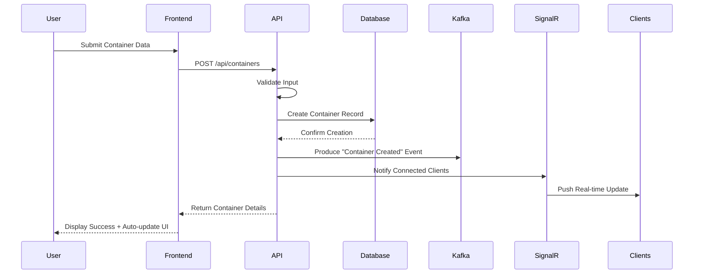
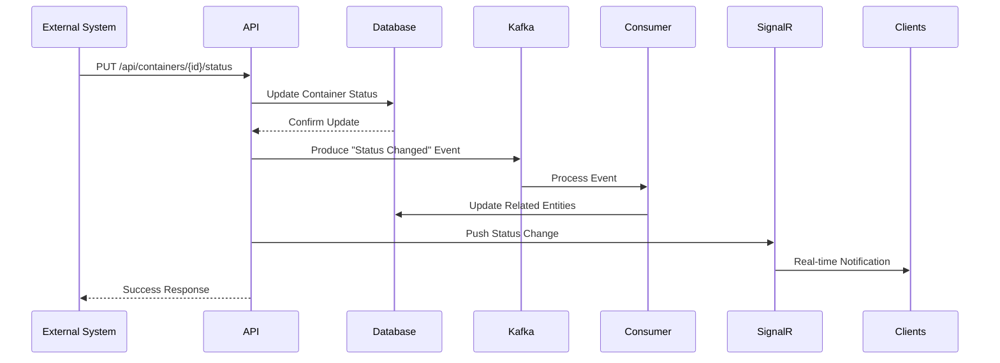
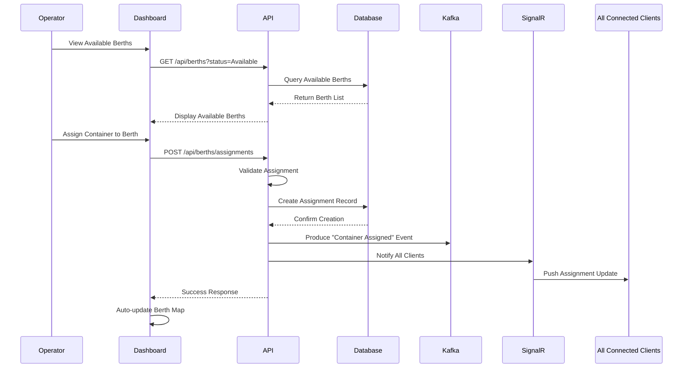
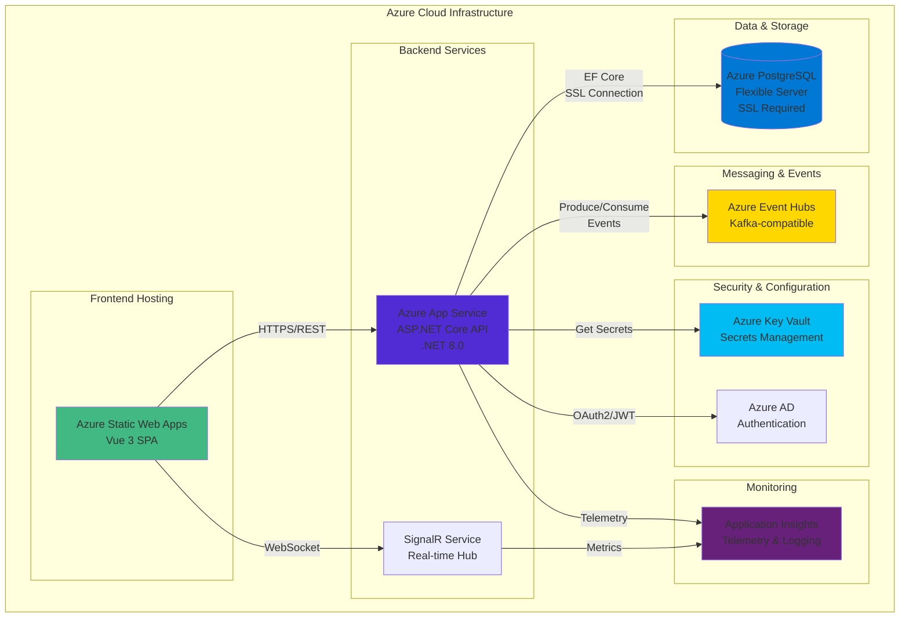

# Architecture Overview - Container Tracking & Port Operations

## Project Name
Container Tracking & Port Operations System

## Date
September 27, 2025

## Architecture Overview

This document outlines the high-level architecture of the Container Tracking & Port Operations System, including component interactions, data flow, and technology choices.

## System Architecture

The system follows a modern microservices-influenced architecture with clearly separated concerns between backend, frontend, and data streaming components.

```mermaid
graph TB
    subgraph "Frontend Layer"
        VUE[Vue 3 Frontend<br/>Static Web App]
    end
    
    subgraph "Backend Layer"
        API[ASP.NET Core Web API<br/>.NET 8.0]
        SIGNALR[SignalR Hub<br/>Real-time Updates]
    end
    
    subgraph "Data Layer"
        AZURE_DB[(Azure PostgreSQL<br/>Flexible Server)]
    end
    
    subgraph "Event Streaming"
        KAFKA[Kafka/Event Hubs<br/>Stream Processing]
        EXTERNAL[External<br/>Event Sources]
    end
    
    VUE -->|HTTP/REST| API
    VUE -->|WebSocket| SIGNALR
    API -->|EF Core| AZURE_DB
    API -->|Produce Events| KAFKA
    KAFKA -->|Consume Events| API
    EXTERNAL -->|Events| KAFKA
    SIGNALR -->|Push Updates| VUE
    
    style VUE fill:#42b983
    style API fill:#512bd4
    style AZURE_DB fill:#0078d4
    style KAFKA fill:#231f20
    style SIGNALR fill:#512bd4
```



### High-Level Architecture Diagram (ASCII)
```
┌─────────────────┐     ┌─────────────────┐     ┌─────────────────┐
│                 │     │                 │     │                 │
│  Vue 3 Frontend │◄────┤  ASP.NET Core   │◄────┤ Azure PostgreSQL│
│  (Static Web)   │     │  Web API        │     │  Flexible Server│
│                 │     │                 │     │                 │
└────────┬────────┘     └────────┬────────┘     └─────────────────┘
         │                       │
         │                       │
┌────────▼────────┐     ┌────────▼────────┐     ┌─────────────────┐
│                 │     │                 │     │                 │
│  SignalR        │◄────┤  Kafka / Event  │◄────┤  External       │
│  (Real-time)    │     │  Hubs (Streams) │     │  Event Sources  │
│                 │     │                 │     │                 │
└─────────────────┘     └─────────────────┘     └─────────────────┘
```

## Component Breakdown

### 1. Frontend Layer (Vue 3 + Vite)
- **Responsibilities**:
  - User interface for container and port operations
  - Real-time dashboard displaying container status
  - Forms for container management and berth assignments
  - Interactive visualizations of port operations
  
- **Key Components**:
  - Pages (Container List, Container Detail, Port Dashboard)
  - Components (BerthMap, ContainerStatusCard, ShipDetail)
  - Pinia Stores (containers, berths, ships, events)
  - API Services (RESTful + SignalR clients)

### 2. Backend Layer (ASP.NET Core Web API)
- **Responsibilities**:
  - RESTful API endpoints for CRUD operations
  - Business logic for container and port operations
  - Event production to Kafka/Event Hubs
  - SignalR hub for real-time client notifications
  
- **Key Components**:
  - Controllers (ContainersController, BerthsController, ShipsController)
  - Models (database entities and DTOs)
  - Services (ContainerService, BerthAssignmentService, EventService)
  - Data Access (Entity Framework Core + Npgsql)
  - Kafka Producers (ContainerEventProducer)
  - SignalR Hubs (ContainerEventsHub)

### 3. Data Persistence Layer
- **Responsibilities**:
  - Store container, berth, port, and ship data
  - Track relationships between entities
  - Support transaction management
  
- **Components**:
  - PostgreSQL Database
  - Entity Framework Core Migrations
  - Entity Configurations (Fluent API)

### 4. Event Streaming Layer
- **Responsibilities**:
  - Capture and broadcast container lifecycle events
  - Enable asynchronous processing of container status updates
  - Support decoupled architecture for scalability
  
- **Components**:
  - Azure Event Hubs (Kafka-compatible API)
  - Kafka Producers (in ASP.NET Core API)
  - Kafka Consumers (in ASP.NET Core background services)

### 5. Real-time Communication Layer
- **Responsibilities**:
  - Push real-time updates to connected clients
  - Support UI auto-refresh for container status changes
  
- **Components**:
  - ASP.NET Core SignalR Hub
  - JavaScript SignalR Client in Vue Frontend

## Data Flow

### Container Creation & Tracking Flow



**Step-by-Step Process:**
1. User submits container data via frontend form
2. Frontend sends POST request to API endpoint
3. API validates input, creates container in database
4. API produces "container created" event to Kafka/Event Hubs
5. Kafka consumer processes event, updates any related entities
6. SignalR hub notifies connected clients of new container
7. Frontend automatically updates UI with new container data

### Container Status Update Flow



**Step-by-Step Process:**
1. External system or user updates container status
2. API receives status update via endpoint
3. API updates container status in database
4. API produces "container status changed" event to Kafka/Event Hubs
5. Event consumer processes status change, updates related entities
6. SignalR pushes status change to connected clients
7. Frontend automatically updates UI with new status

### Berth Assignment Flow



**Step-by-Step Process:**
1. Operator views available berths on dashboard
2. Operator assigns container to berth via UI
3. Frontend sends assignment request to API
4. API validates assignment, creates record in database
5. API produces "container assigned" event to Kafka/Event Hubs
6. SignalR notifies all clients of new berth assignment
7. Dashboard updates to show assigned container in berth

## Deployment Architecture



### Azure Deployment Overview (ASCII)
```
┌────────────────────────────────────────────────┐
│                Azure Cloud                     │
│                                                │
│  ┌───────────┐      ┌───────────┐      ┌────┐  │
│  │ Static    │      │ App       │      │    │  │
│  │ Web App   │─────▶│ Service   │─────▶│ DB │  │
│  │ (Vue)     │      │ (API)     │      │    │  │
│  └───────────┘      └───────────┘      └────┘  │
│        │                   │                   │
│        │                   ▼                   │
│        │             ┌─────────────┐           │
│        └───────────▶ │ Event Hubs  │           │
│                      │ (Kafka)     │           │
│                      └─────────────┘           │
└────────────────────────────────────────────────┘
```

### Current Azure Infrastructure

- **Database Server:** `container-tracking-db-server.postgres.database.azure.com`
- **Database Name:** `container-tracking-db`
- **SSL Mode:** Required (enforced)
- **Connection:** Npgsql with Entity Framework Core 9.0.9
- **Migrations Applied:** 3 (InitialCreate, UpdateSchemaToMatchDiagram, AddAuthenticationTables)
- **Data Seeding:** Enhanced seeding with 25 ports, 60+ ships, 300 containers

## Development Environment

Local development is containerized using Docker Compose:

- PostgreSQL container for database
- Kafka/Zookeeper containers for event streaming
- Local ASP.NET Core API running on developer machine
- Vue dev server with hot module reloading

## Security Considerations

The system is designed with security in mind:

- API input validation to prevent injection attacks
- Prepared for future authentication via Azure AD
- CORS policies for frontend-backend communication
- Environment-based configuration for sensitive values
- Connection string and credentials management via Azure Key Vault (planned)

## Monitoring & Logging

- Application Insights integration planned for API monitoring
- Structured logging with Serilog
- Dashboard for system health metrics
- Alert system for critical events

## Next Steps

1. Implement core API endpoints and database migrations
2. Set up Event Hubs and Kafka configuration
3. Develop SignalR hub and client integration
4. Create frontend dashboards and forms
5. Configure CI/CD pipeline