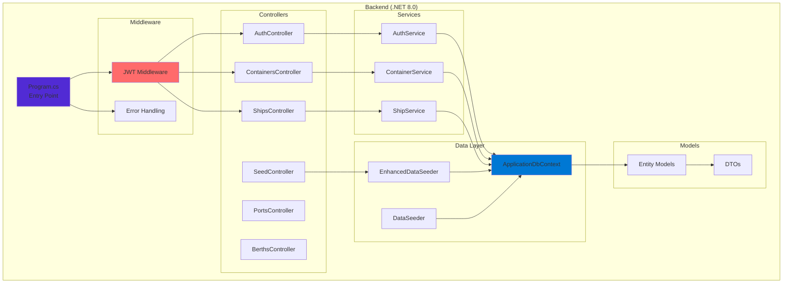

# Development Setup Guide - Container Tracking & Port Operations

## Project Name
Container Tracking & Port Operations System

## Date
September 30, 2025

## Overview

This guide provides step-by-step instructions for setting up the development environment for the Container Tracking & Port Operations System. The backend API is fully implemented with JWT authentication, RBAC, and is deployed to **Azure PostgreSQL Flexible Server** for production use.

### Current Deployment Status
- ✅ **Backend API:** ASP.NET Core 8.0 with Entity Framework Core 9.0.9
- ✅ **Database:** Azure PostgreSQL Flexible Server (container-tracking-db-server.postgres.database.azure.com)
- ✅ **Authentication:** JWT-based RBAC with 4 roles and 21 permissions
- ✅ **Data Seeding:** Enhanced seeding with 25 ports, 60+ ships, 300 containers
- ✅ **Migrations:** 3 migrations applied (InitialCreate, UpdateSchemaToMatchDiagram, AddAuthenticationTables)

## Prerequisites

Before starting, ensure you have the following installed:

### Required Software
- **.NET 8.0 SDK** - [Download](https://dotnet.microsoft.com/download/dotnet/8.0)
- **PostgreSQL 13+** - [Download](https://www.postgresql.org/download/)
- **Git** - [Download](https://git-scm.com/)
- **Visual Studio Code** or **Visual Studio 2022** (recommended IDE)

### Optional Tools
- **pgAdmin** - PostgreSQL administration tool
- **Postman** - API testing tool
- **Docker Desktop** - For containerized development

## Quick Start (5 Minutes)

### 1. Clone the Repository
```bash
git clone https://github.com/kalviumcommunity/Container-Tracking-and-Port-Operations-Maersk-Hackathon.git
cd Container-Tracking-and-Port-Operations-Maersk-Hackathon
```

### 2. Setup Database
Create a PostgreSQL database:
```sql
-- Connect to PostgreSQL and run:
CREATE DATABASE container_tracking;
```

### 3. Configure Connection String
Update the connection string in `backend/appsettings.json`:
```json
{
  "ConnectionStrings": {
    "DefaultConnection": "Host=localhost;Database=container_tracking;Username=your_username;Password=your_password"
  }
}
```

**Or use environment variables (recommended):**
```bash
# Windows (PowerShell)
$env:ConnectionStrings__DefaultConnection="Host=localhost;Database=container_tracking;Username=your_username;Password=your_password"

# Linux/macOS
export ConnectionStrings__DefaultConnection="Host=localhost;Database=container_tracking;Username=your_username;Password=your_password"
```

### 4. Run the Application
```bash
cd backend
dotnet run
```

### 5. Access the API
- **API Base URL**: http://localhost:5221
- **Swagger Documentation**: http://localhost:5221/swagger
- **Test with Postman**: Import `Container-Tracking-API.postman_collection.json`

## Detailed Setup Instructions

### Database Setup

#### Option 1: Local PostgreSQL Installation

1. **Install PostgreSQL**
   - Download and install PostgreSQL from the official website
   - Remember the password you set for the `postgres` user

2. **Create Database**
   ```sql
   -- Using psql command line:
   psql -U postgres
   CREATE DATABASE container_tracking;
   \q
   ```

3. **Create User (Optional)**
   ```sql
   CREATE USER container_app WITH PASSWORD 'your_secure_password';
   GRANT ALL PRIVILEGES ON DATABASE container_tracking TO container_app;
   ```

#### Option 2: Docker PostgreSQL

```bash
# Run PostgreSQL in Docker
docker run --name postgres-container-tracking \
  -e POSTGRES_DB=container_tracking \
  -e POSTGRES_USER=container_app \
  -e POSTGRES_PASSWORD=your_secure_password \
  -p 5432:5432 \
  -d postgres:13
```

#### Option 3: Azure PostgreSQL (Production - Already Configured)

The project is already configured to use Azure PostgreSQL Flexible Server:

**Connection Details:**
- **Server:** `container-tracking-db-server.postgres.database.azure.com`
- **Database:** `container-tracking-db`
- **SSL Mode:** Required (enforced for security)
- **Port:** 5432

**Environment Variables in `.env`:**
```env
DB_HOST=container-tracking-db-server.postgres.database.azure.com
DB_PORT=5432
DB_DATABASE=container-tracking-db
DB_USER=your_azure_username
DB_PASSWORD=your_azure_password
DB_SSL_MODE=Require

JWT_KEY=your_base64_encoded_jwt_secret
JWT_ISSUER=ContainerTrackingAPI
JWT_AUDIENCE=ContainerTrackingClient
JWT_EXPIRE_HOURS=24
```

**To connect to Azure PostgreSQL:**
1. Ensure your IP is whitelisted in Azure Firewall settings
2. Use the `.env` configuration (already set up)
3. Run migrations: `dotnet ef database update`
4. Seed enhanced data: `.\seed-enhanced-data.ps1`

### Environment Configuration

Create a `.env` file in the backend directory:
```env
ConnectionStrings__DefaultConnection=Host=localhost;Database=container_tracking;Username=container_app;Password=your_secure_password
ASPNETCORE_ENVIRONMENT=Development
ASPNETCORE_URLS=http://localhost:5221
```

### Building and Running

#### Using .NET CLI
```bash
# Navigate to backend directory
cd backend

# Restore packages
dotnet restore

# Build the project
dotnet build

# Run the application
dotnet run
```

#### Using Visual Studio
1. Open `Container-Tracking-and-Port-Operations-Maersk-Hackathon.sln`
2. Set `backend` as startup project
3. Press F5 to run with debugging

#### Using Visual Studio Code
1. Open the project folder in VS Code
2. Install recommended extensions:
   - C# for Visual Studio Code
   - REST Client (for API testing)
3. Use Ctrl+Shift+P → ".NET: Generate Assets for Build and Debug"
4. Press F5 to run

### Database Migration and Seeding

The application automatically handles database creation and seeding:

1. **On First Run**: The application will create all necessary tables
2. **Sample Data**: Comprehensive test data is automatically seeded
3. **Subsequent Runs**: Existing data is preserved, no duplicate seeding

#### Manual Migration (if needed)
```bash
# Add migration (only if model changes)
dotnet ef migrations add InitialCreate

# Update database
dotnet ef database update
```

## Project Structure



### Folder Structure
```
backend/
├── Controllers/           # API Controllers (6 complete endpoints)
├── Services/             # Business logic layer
├── Repositories/         # Data access layer
├── Models/              # Entity Framework models
├── DTOs/                # Data transfer objects
├── Data/                # Database context and seeding
│   └── Seeding/         # DataSeeder.cs, EnhancedDataSeeder.cs
├── Extensions/          # Service registration and middleware
├── Middleware/          # Custom middleware
├── appsettings.json     # Configuration file
├── .env                 # Environment variables (Azure config)
└── Program.cs           # Application entry point
```

## Testing the Setup

### 1. API Health Check
```bash
# Test if API is running
curl http://localhost:5221/api/containers
```

### 2. Swagger UI
Navigate to http://localhost:5221/swagger to test all endpoints interactively.

### 3. Postman Testing
1. Import `Container-Tracking-API.postman_collection.json`
2. Set base URL variable to `http://localhost:5221`
3. Run test collections

### 4. Database Verification
```sql
-- Connect to database and verify tables
\dt

-- Check sample data
SELECT COUNT(*) FROM "Containers";
SELECT COUNT(*) FROM "Ships";
SELECT COUNT(*) FROM "Ports";
```

## Common Issues and Solutions

### Issue: Connection String Error
**Problem**: `Npgsql.NpgsqlException: Connection refused`
**Solution**: 
- Verify PostgreSQL is running
- Check connection string parameters
- Ensure database exists

### Issue: Port Already in Use
**Problem**: `Address already in use`
**Solution**:
```bash
# Change port in appsettings.json or use:
dotnet run --urls "http://localhost:5222"
```

### Issue: Migration Errors
**Problem**: Entity Framework migration issues
**Solution**:
```bash
# Reset database
dotnet ef database drop
dotnet ef database update
```

### Issue: Missing Packages
**Problem**: Package restore errors
**Solution**:
```bash
dotnet clean
dotnet restore
dotnet build
```

## Development Workflow

### 1. Making Changes
1. Create feature branch: `git checkout -b feat/your-feature`
2. Make code changes
3. Test with Swagger UI or Postman
4. Commit changes: `git commit -m "Add your feature"`

### 2. API Development
- Controllers are in `Controllers/` folder
- Add business logic to `Services/`
- Data access goes in `Repositories/`
- Update DTOs for API responses

### 3. Database Changes
1. Modify entities in `Models/`
2. Add migration: `dotnet ef migrations add YourMigrationName`
3. Update database: `dotnet ef database update`

## Performance Optimization

### Development Settings
- Enable detailed EF logging in `appsettings.Development.json`
- Use SQL Server Profiler or pgAdmin for query analysis
- Monitor API response times with Swagger

### Database Optimization
- Indexes are automatically created for foreign keys
- Consider adding custom indexes for frequently queried fields
- Use EF Core query logging to identify N+1 queries

## Next Steps

1. **Frontend Development**: Vue 3 application setup
2. **Authentication**: Add JWT authentication
3. **Real-time Features**: Implement SignalR for live updates
4. **Event Streaming**: Add Kafka/Azure Event Hubs integration
5. **Docker Deployment**: Create Docker containers for deployment

## Support and Resources

### Documentation
- [Complete API Specification](api-specification.md)
- [Testing Guide](testing_guide.md)
- [Database Entity Relationships](database-entity-relationships.md)

### External Resources
- [ASP.NET Core Documentation](https://docs.microsoft.com/en-us/aspnet/core/)
- [Entity Framework Core Documentation](https://docs.microsoft.com/en-us/ef/core/)
- [PostgreSQL Documentation](https://www.postgresql.org/docs/)

### Getting Help
1. Check existing documentation in `docs/` folder
2. Use Swagger UI for API endpoint testing
3. Import Postman collection for comprehensive testing scenarios
4. Review sample data in database for expected data structures

---

**🎉 You're Ready to Develop!** The API is fully functional and ready for frontend integration and advanced feature development.