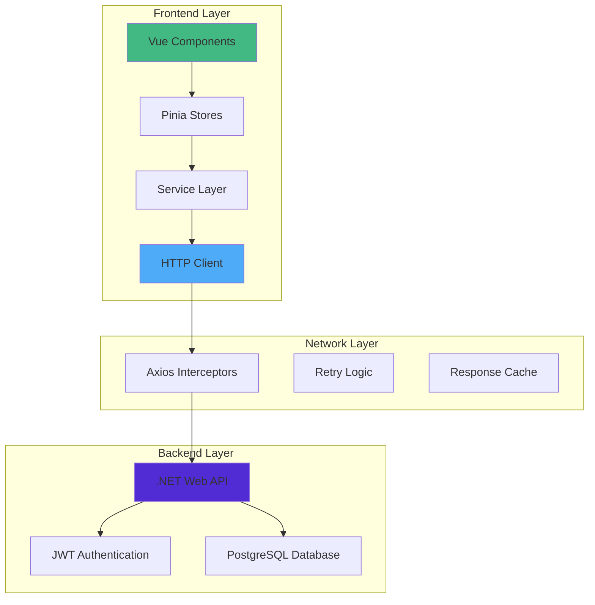

# 🔗 API Integration Guide

## Overview

This guide covers the complete integration between the Maersk Container Tracking frontend (Vue.js) and backend (.NET API), including HTTP client configuration, service layer implementation, error handling, and authentication flow.

## 🏗️ Integration Architecture



## ⚙️ HTTP Client Configuration

### 1. **Base API Client Setup** (`services/api.ts`)

```typescript
import axios, { 
  AxiosInstance, 
  AxiosRequestConfig, 
  AxiosResponse,
  InternalAxiosRequestConfig,
  AxiosError
} from 'axios'
import { useAuthStore } from '@/stores/auth'
import { useNotificationStore } from '@/stores/notifications'
import type { ApiResponse } from '@/types/api'

class ApiClient {
  private client: AxiosInstance
  private isRefreshing = false
  private failedQueue: Array<{
    resolve: (value?: any) => void
    reject: (reason?: any) => void
  }> = []

  constructor() {
    this.client = axios.create({
      baseURL: this.getBaseURL(),
      timeout: parseInt(import.meta.env.VITE_API_TIMEOUT) || 10000,
      headers: {
        'Content-Type': 'application/json',
        'Accept': 'application/json',
        'X-Requested-With': 'XMLHttpRequest'
      }
    })

    this.setupInterceptors()
  }

  private getBaseURL(): string {
    const baseURL = import.meta.env.VITE_API_BASE_URL
    if (!baseURL) {
      console.warn('VITE_API_BASE_URL not configured, using default')
      return 'http://localhost:5221'
    }
    return baseURL.endsWith('/') ? baseURL.slice(0, -1) : baseURL
  }

  private setupInterceptors(): void {
    // Request Interceptor
    this.client.interceptors.request.use(
      (config: InternalAxiosRequestConfig) => {
        const authStore = useAuthStore()
        
        // Add auth token
        if (authStore.token) {
          config.headers.Authorization = `Bearer ${authStore.token}`
        }

        // Add request timestamp for debugging
        config.metadata = { startTime: new Date() }

        // Log request in development
        if (import.meta.env.DEV) {
          console.log(`🚀 API Request: ${config.method?.toUpperCase()} ${config.url}`, {
            params: config.params,
            data: config.data
          })
        }

        return config
      },
      (error) => {
        console.error('Request interceptor error:', error)
        return Promise.reject(error)
      }
    )

    // Response Interceptor
    this.client.interceptors.response.use(
      (response: AxiosResponse) => {
        // Log response in development
        if (import.meta.env.DEV) {
          const duration = new Date().getTime() - response.config.metadata?.startTime?.getTime()
          console.log(`✅ API Response: ${response.config.method?.toUpperCase()} ${response.config.url} (${duration}ms)`, response.data)
        }

        return response
      },
      async (error: AxiosError) => {
        const originalRequest = error.config as any

        // Handle different error types
        if (error.code === 'ECONNABORTED') {
          this.handleTimeoutError(error)
        } else if (error.response?.status === 401) {
          return this.handleUnauthorizedError(error, originalRequest)
        } else if (error.response?.status >= 500) {
          this.handleServerError(error)
        } else if (error.response?.status >= 400) {
          this.handleClientError(error)
        } else if (!error.response) {
          this.handleNetworkError(error)
        }

        return Promise.reject(error)
      }
    )
  }

  private async handleUnauthorizedError(error: AxiosError, originalRequest: any) {
    const authStore = useAuthStore()

    if (!this.isRefreshing) {
      this.isRefreshing = true

      try {
        // Try to refresh token
        await authStore.refreshToken()
        this.isRefreshing = false
        
        // Retry failed requests
        this.processQueue(null)
        
        // Retry original request with new token
        if (authStore.token) {
          originalRequest.headers.Authorization = `Bearer ${authStore.token}`
          return this.client(originalRequest)
        }
      } catch (refreshError) {
        this.isRefreshing = false
        this.processQueue(refreshError)
        
        // Redirect to login
        await authStore.logout()
        window.location.href = '/login'
        return Promise.reject(refreshError)
      }
    }

    // Queue the request while refreshing
    return new Promise((resolve, reject) => {
      this.failedQueue.push({ resolve, reject })
    })
  }

  private processQueue(error: any) {
    this.failedQueue.forEach(({ resolve, reject }) => {
      if (error) {
        reject(error)
      } else {
        resolve()
      }
    })
    
    this.failedQueue = []
  }

  private handleTimeoutError(error: AxiosError) {
    const notificationStore = useNotificationStore()
    notificationStore.addNotification({
      type: 'error',
      message: 'Request timeout. Please check your connection and try again.',
      duration: 5000
    })
  }

  private handleServerError(error: AxiosError) {
    const notificationStore = useNotificationStore()
    notificationStore.addNotification({
      type: 'error',
      message: 'Server error. Please try again later.',
      duration: 5000
    })
  }

  private handleClientError(error: AxiosError) {
    if (error.response?.status === 422) {
      // Validation errors are handled by individual services
      return
    }

    const notificationStore = useNotificationStore()
    const message = error.response?.data?.message || 'An error occurred'
    
    notificationStore.addNotification({
      type: 'error',
      message,
      duration: 5000
    })
  }

  private handleNetworkError(error: AxiosError) {
    const notificationStore = useNotificationStore()
    notificationStore.addNotification({
      type: 'error',
      message: 'Network error. Please check your internet connection.',
      duration: 5000
    })
  }

  // Generic HTTP methods
  async get<T>(url: string, config?: AxiosRequestConfig): Promise<ApiResponse<T>> {
    const response = await this.client.get(url, config)
    return response.data
  }

  async post<T>(url: string, data?: any, config?: AxiosRequestConfig): Promise<ApiResponse<T>> {
    const response = await this.client.post(url, data, config)
    return response.data
  }

  async put<T>(url: string, data?: any, config?: AxiosRequestConfig): Promise<ApiResponse<T>> {
    const response = await this.client.put(url, data, config)
    return response.data
  }

  async patch<T>(url: string, data?: any, config?: AxiosRequestConfig): Promise<ApiResponse<T>> {
    const response = await this.client.patch(url, data, config)
    return response.data
  }

  async delete<T>(url: string, config?: AxiosRequestConfig): Promise<ApiResponse<T>> {
    const response = await this.client.delete(url, config)
    return response.data
  }

  // Upload file with progress
  async upload<T>(
    url: string, 
    file: File, 
    onProgress?: (progress: number) => void
  ): Promise<ApiResponse<T>> {
    const formData = new FormData()
    formData.append('file', file)

    const response = await this.client.post(url, formData, {
      headers: {
        'Content-Type': 'multipart/form-data'
      },
      onUploadProgress: (progressEvent) => {
        if (onProgress && progressEvent.total) {
          const progress = Math.round((progressEvent.loaded * 100) / progressEvent.total)
          onProgress(progress)
        }
      }
    })

    return response.data
  }
}

export const apiClient = new ApiClient()
```

### 2. **Environment Configuration**

```env
# .env
VITE_API_BASE_URL=http://localhost:5221
VITE_API_TIMEOUT=10000
VITE_DEBUG_MODE=true

# .env.production
VITE_API_BASE_URL=https://api-container-tracking.azurewebsites.net
VITE_API_TIMEOUT=15000
VITE_DEBUG_MODE=false
```

## 🔐 Authentication Service

### Authentication API Service (`services/auth.service.ts`)

```typescript
import { apiClient } from './api'
import type { 
  LoginCredentials, 
  AuthResponse, 
  User, 
  RefreshTokenRequest 
} from '@/types/auth'

class AuthService {
  private readonly basePath = '/api/auth'

  async login(credentials: LoginCredentials): Promise<ApiResponse<AuthResponse>> {
    return apiClient.post<AuthResponse>(`${this.basePath}/login`, credentials)
  }

  async register(userData: RegisterData): Promise<ApiResponse<User>> {
    return apiClient.post<User>(`${this.basePath}/register`, userData)
  }

  async refreshToken(refreshToken: string): Promise<ApiResponse<AuthResponse>> {
    return apiClient.post<AuthResponse>(`${this.basePath}/refresh`, { 
      refreshToken 
    })
  }

  async logout(): Promise<ApiResponse<void>> {
    return apiClient.post<void>(`${this.basePath}/logout`)
  }

  async getProfile(): Promise<ApiResponse<User>> {
    return apiClient.get<User>(`${this.basePath}/profile`)
  }

  async updateProfile(profileData: UpdateProfileData): Promise<ApiResponse<User>> {
    return apiClient.put<User>(`${this.basePath}/profile`, profileData)
  }

  async changePassword(passwordData: ChangePasswordData): Promise<ApiResponse<void>> {
    return apiClient.post<void>(`${this.basePath}/change-password`, passwordData)
  }

  async requestPasswordReset(email: string): Promise<ApiResponse<void>> {
    return apiClient.post<void>(`${this.basePath}/forgot-password`, { email })
  }

  async resetPassword(token: string, newPassword: string): Promise<ApiResponse<void>> {
    return apiClient.post<void>(`${this.basePath}/reset-password`, {
      token,
      newPassword
    })
  }
}

export const authService = new AuthService()
```

## 📦 Domain-Specific Services

### 1. **Container Service** (`services/container.service.ts`)

```typescript
import { apiClient } from './api'
import type { 
  Container, 
  CreateContainerData, 
  UpdateContainerData, 
  ContainerSearchParams,
  PaginatedResponse 
} from '@/types/container'

class ContainerService {
  private readonly basePath = '/api/containers'

  async getAll(params?: ContainerSearchParams): Promise<ApiResponse<PaginatedResponse<Container>>> {
    return apiClient.get<PaginatedResponse<Container>>(this.basePath, { params })
  }

  async getById(id: number): Promise<ApiResponse<Container>> {
    return apiClient.get<Container>(`${this.basePath}/${id}`)
  }

  async create(data: CreateContainerData): Promise<ApiResponse<Container>> {
    // Client-side validation
    this.validateContainerData(data)
    
    return apiClient.post<Container>(this.basePath, data)
  }

  async update(id: number, data: UpdateContainerData): Promise<ApiResponse<Container>> {
    return apiClient.put<Container>(`${this.basePath}/${id}`, data)
  }

  async delete(id: number): Promise<ApiResponse<void>> {
    return apiClient.delete<void>(`${this.basePath}/${id}`)
  }

  async search(query: string): Promise<ApiResponse<Container[]>> {
    return apiClient.get<Container[]>(`${this.basePath}/search`, {
      params: { q: query }
    })
  }

  async updateStatus(id: number, status: ContainerStatus): Promise<ApiResponse<Container>> {
    return apiClient.patch<Container>(`${this.basePath}/${id}/status`, { status })
  }

  async getMovements(id: number): Promise<ApiResponse<ContainerMovement[]>> {
    return apiClient.get<ContainerMovement[]>(`${this.basePath}/${id}/movements`)
  }

  async addMovement(id: number, movement: CreateMovementData): Promise<ApiResponse<ContainerMovement>> {
    return apiClient.post<ContainerMovement>(`${this.basePath}/${id}/movements`, movement)
  }

  async bulkUpdate(updates: BulkUpdateData[]): Promise<ApiResponse<Container[]>> {
    return apiClient.post<Container[]>(`${this.basePath}/bulk-update`, { updates })
  }

  async export(params?: ContainerSearchParams): Promise<Blob> {
    const response = await apiClient.get(`${this.basePath}/export`, {
      params,
      responseType: 'blob'
    })
    return response.data
  }

  private validateContainerData(data: CreateContainerData): void {
    if (!data.containerNumber || !/^[A-Z]{4}[0-9]{7}$/.test(data.containerNumber)) {
      throw new Error('Invalid container number format')
    }

    if (!data.type || !['Standard', 'Refrigerated', 'Tank', 'Flat Rack'].includes(data.type)) {
      throw new Error('Invalid container type')
    }

    if (data.weight && (data.weight < 0 || data.weight > 50000)) {
      throw new Error('Container weight must be between 0 and 50,000 kg')
    }
  }
}

export const containerService = new ContainerService()
```

### 2. **Ship Service** (`services/ship.service.ts`)

```typescript
import { apiClient } from './api'
import type { Ship, CreateShipData, UpdateShipData, ShipSearchParams } from '@/types/ship'

class ShipService {
  private readonly basePath = '/api/ships'

  async getAll(params?: ShipSearchParams): Promise<ApiResponse<PaginatedResponse<Ship>>> {
    return apiClient.get<PaginatedResponse<Ship>>(this.basePath, { params })
  }

  async getById(id: number): Promise<ApiResponse<Ship>> {
    return apiClient.get<Ship>(`${this.basePath}/${id}`)
  }

  async create(data: CreateShipData): Promise<ApiResponse<Ship>> {
    this.validateIMONumber(data.imoNumber)
    return apiClient.post<Ship>(this.basePath, data)
  }

  async update(id: number, data: UpdateShipData): Promise<ApiResponse<Ship>> {
    return apiClient.put<Ship>(`${this.basePath}/${id}`, data)
  }

  async delete(id: number): Promise<ApiResponse<void>> {
    return apiClient.delete<void>(`${this.basePath}/${id}`)
  }

  async getContainers(id: number): Promise<ApiResponse<Container[]>> {
    return apiClient.get<Container[]>(`${this.basePath}/${id}/containers`)
  }

  async assignContainer(shipId: number, containerId: number): Promise<ApiResponse<void>> {
    return apiClient.post<void>(`${this.basePath}/${shipId}/containers/${containerId}`)
  }

  async unassignContainer(shipId: number, containerId: number): Promise<ApiResponse<void>> {
    return apiClient.delete<void>(`${this.basePath}/${shipId}/containers/${containerId}`)
  }

  private validateIMONumber(imoNumber: string): void {
    const imoRegex = /^IMO[0-9]{7}$/
    if (!imoRegex.test(imoNumber)) {
      throw new Error('Invalid IMO number format')
    }
  }
}

export const shipService = new ShipService()
```

### 3. **Berth Service** (`services/berth.service.ts`)

```typescript
import { apiClient } from './api'
import type { 
  Berth, 
  BerthAssignment, 
  CreateBerthAssignmentData, 
  UpdateBerthAssignmentData 
} from '@/types/berth'

class BerthService {
  private readonly berthPath = '/api/berths'
  private readonly assignmentPath = '/api/berth-assignments'

  // Berth operations
  async getAllBerths(): Promise<ApiResponse<Berth[]>> {
    return apiClient.get<Berth[]>(this.berthPath)
  }

  async getBerthById(id: number): Promise<ApiResponse<Berth>> {
    return apiClient.get<Berth>(`${this.berthPath}/${id}`)
  }

  async getAvailableBerths(startDate?: string, endDate?: string): Promise<ApiResponse<Berth[]>> {
    return apiClient.get<Berth[]>(`${this.berthPath}/available`, {
      params: { startDate, endDate }
    })
  }

  // Berth assignment operations
  async getAllAssignments(params?: {
    startDate?: string
    endDate?: string
    status?: string
  }): Promise<ApiResponse<BerthAssignment[]>> {
    return apiClient.get<BerthAssignment[]>(this.assignmentPath, { params })
  }

  async createAssignment(data: CreateBerthAssignmentData): Promise<ApiResponse<BerthAssignment>> {
    this.validateAssignmentData(data)
    return apiClient.post<BerthAssignment>(this.assignmentPath, data)
  }

  async updateAssignment(id: number, data: UpdateBerthAssignmentData): Promise<ApiResponse<BerthAssignment>> {
    return apiClient.put<BerthAssignment>(`${this.assignmentPath}/${id}`, data)
  }

  async deleteAssignment(id: number): Promise<ApiResponse<void>> {
    return apiClient.delete<void>(`${this.assignmentPath}/${id}`)
  }

  async getAssignmentById(id: number): Promise<ApiResponse<BerthAssignment>> {
    return apiClient.get<BerthAssignment>(`${this.assignmentPath}/${id}`)
  }

  private validateAssignmentData(data: CreateBerthAssignmentData): void {
    const arrival = new Date(data.scheduledArrival)
    const departure = new Date(data.scheduledDeparture)

    if (arrival >= departure) {
      throw new Error('Departure time must be after arrival time')
    }

    if (arrival < new Date()) {
      throw new Error('Arrival time cannot be in the past')
    }
  }
}

export const berthService = new BerthService()
```

### 4. **Analytics Service** (`services/analytics.service.ts`)

```typescript
import { apiClient } from './api'
import type { 
  DashboardStats, 
  ThroughputData, 
  BerthUtilizationData, 
  RealtimeMetrics,
  CustomReportData 
} from '@/types/analytics'

class AnalyticsService {
  private readonly basePath = '/api/analytics'

  async getDashboardStats(): Promise<ApiResponse<DashboardStats>> {
    return apiClient.get<DashboardStats>(`${this.basePath}/dashboard-stats`)
  }

  async getThroughputData(params: {
    period: 'daily' | 'weekly' | 'monthly'
    startDate?: string
    endDate?: string
  }): Promise<ApiResponse<ThroughputData[]>> {
    return apiClient.get<ThroughputData[]>(`${this.basePath}/throughput`, { params })
  }

  async getBerthUtilization(portId?: number): Promise<ApiResponse<BerthUtilizationData[]>> {
    return apiClient.get<BerthUtilizationData[]>(`${this.basePath}/berth-utilization`, {
      params: { portId }
    })
  }

  async getRealtimeMetrics(): Promise<ApiResponse<RealtimeMetrics>> {
    return apiClient.get<RealtimeMetrics>(`${this.basePath}/realtime-metrics`)
  }

  async generateCustomReport(params: {
    reportType: string
    startDate: string
    endDate: string
    filters?: Record<string, any>
  }): Promise<ApiResponse<CustomReportData>> {
    return apiClient.post<CustomReportData>(`${this.basePath}/custom-report`, params)
  }

  async exportData(params: {
    type: 'containers' | 'ships' | 'berths' | 'analytics'
    format: 'csv' | 'xlsx'
    filters?: Record<string, any>
  }): Promise<Blob> {
    const response = await apiClient.get(`${this.basePath}/export`, {
      params,
      responseType: 'blob'
    })
    return response.data
  }
}

export const analyticsService = new AnalyticsService()
```

## 🏪 Store Integration with Services

### Container Store with API Integration (`stores/containers.ts`)

```typescript
import { defineStore } from 'pinia'
import { ref, computed } from 'vue'
import { containerService } from '@/services/container.service'
import { useNotificationStore } from '@/stores/notifications'
import type { Container, CreateContainerData, ContainerSearchParams } from '@/types/container'

export const useContainerStore = defineStore('containers', () => {
  // State
  const containers = ref<Container[]>([])
  const loading = ref(false)
  const error = ref<string | null>(null)
  const selectedContainer = ref<Container | null>(null)
  const searchParams = ref<ContainerSearchParams>({})
  const totalCount = ref(0)
  const currentPage = ref(1)
  const pageSize = ref(10)

  // Getters
  const availableContainers = computed(() =>
    containers.value.filter(c => c.status === 'Available')
  )

  const containersByStatus = computed(() => {
    return containers.value.reduce((acc, container) => {
      if (!acc[container.status]) {
        acc[container.status] = []
      }
      acc[container.status].push(container)
      return acc
    }, {} as Record<string, Container[]>)
  })

  const isLastPage = computed(() => {
    return currentPage.value * pageSize.value >= totalCount.value
  })

  // Actions
  const fetchContainers = async (params?: ContainerSearchParams) => {
    loading.value = true
    error.value = null

    try {
      const searchParameters = {
        ...searchParams.value,
        ...params,
        page: params?.page || currentPage.value,
        size: params?.size || pageSize.value
      }

      const response = await containerService.getAll(searchParameters)
      
      if (response.success) {
        containers.value = response.data.items
        totalCount.value = response.data.totalCount
        currentPage.value = response.data.page
        searchParams.value = searchParameters
      } else {
        throw new Error(response.message || 'Failed to fetch containers')
      }
    } catch (err) {
      error.value = err instanceof Error ? err.message : 'Failed to fetch containers'
      console.error('Fetch containers error:', err)
    } finally {
      loading.value = false
    }
  }

  const createContainer = async (data: CreateContainerData) => {
    const notificationStore = useNotificationStore()

    try {
      const response = await containerService.create(data)
      
      if (response.success) {
        containers.value.unshift(response.data)
        totalCount.value += 1
        
        notificationStore.addNotification({
          type: 'success',
          message: `Container ${response.data.containerNumber} created successfully`,
          duration: 3000
        })
        
        return response.data
      } else {
        throw new Error(response.message || 'Failed to create container')
      }
    } catch (err) {
      const errorMessage = err instanceof Error ? err.message : 'Failed to create container'
      
      notificationStore.addNotification({
        type: 'error',
        message: errorMessage,
        duration: 5000
      })
      
      throw err
    }
  }

  const updateContainer = async (id: number, data: Partial<Container>) => {
    const notificationStore = useNotificationStore()

    try {
      const response = await containerService.update(id, data)
      
      if (response.success) {
        const index = containers.value.findIndex(c => c.id === id)
        if (index !== -1) {
          containers.value[index] = response.data
        }

        if (selectedContainer.value?.id === id) {
          selectedContainer.value = response.data
        }

        notificationStore.addNotification({
          type: 'success',
          message: `Container ${response.data.containerNumber} updated successfully`,
          duration: 3000
        })

        return response.data
      } else {
        throw new Error(response.message || 'Failed to update container')
      }
    } catch (err) {
      const errorMessage = err instanceof Error ? err.message : 'Failed to update container'
      
      notificationStore.addNotification({
        type: 'error',
        message: errorMessage,
        duration: 5000
      })
      
      throw err
    }
  }

  const deleteContainer = async (id: number) => {
    const notificationStore = useNotificationStore()
    const container = containers.value.find(c => c.id === id)

    try {
      const response = await containerService.delete(id)
      
      if (response.success) {
        const index = containers.value.findIndex(c => c.id === id)
        if (index !== -1) {
          containers.value.splice(index, 1)
          totalCount.value -= 1
        }

        if (selectedContainer.value?.id === id) {
          selectedContainer.value = null
        }

        notificationStore.addNotification({
          type: 'success',
          message: `Container ${container?.containerNumber} deleted successfully`,
          duration: 3000
        })
      } else {
        throw new Error(response.message || 'Failed to delete container')
      }
    } catch (err) {
      const errorMessage = err instanceof Error ? err.message : 'Failed to delete container'
      
      notificationStore.addNotification({
        type: 'error',
        message: errorMessage,
        duration: 5000
      })
      
      throw err
    }
  }

  const searchContainers = async (query: string) => {
    if (!query.trim()) {
      return fetchContainers()
    }

    try {
      const response = await containerService.search(query)
      
      if (response.success) {
        containers.value = response.data
        totalCount.value = response.data.length
        currentPage.value = 1
      }
    } catch (err) {
      console.error('Search containers error:', err)
    }
  }

  const selectContainer = (container: Container | null) => {
    selectedContainer.value = container
  }

  const clearError = () => {
    error.value = null
  }

  const resetStore = () => {
    containers.value = []
    loading.value = false
    error.value = null
    selectedContainer.value = null
    searchParams.value = {}
    totalCount.value = 0
    currentPage.value = 1
  }

  return {
    // State
    containers,
    loading,
    error,
    selectedContainer,
    searchParams,
    totalCount,
    currentPage,
    pageSize,
    
    // Getters
    availableContainers,
    containersByStatus,
    isLastPage,
    
    // Actions
    fetchContainers,
    createContainer,
    updateContainer,
    deleteContainer,
    searchContainers,
    selectContainer,
    clearError,
    resetStore
  }
})
```

## ❌ Error Handling Patterns

### 1. **Validation Error Handling**

```typescript
// composables/useFormValidation.ts
export function useFormValidation<T extends Record<string, any>>(
  initialData: T,
  validationRules: ValidationRules<T>
) {
  const formData = ref<T>({ ...initialData })
  const errors = ref<Partial<Record<keyof T, string>>>({})
  const isValid = ref(false)

  const validateField = (field: keyof T) => {
    const rule = validationRules[field]
    const value = formData.value[field]

    if (rule) {
      const error = rule(value)
      if (error) {
        errors.value[field] = error
      } else {
        delete errors.value[field]
      }
    }
  }

  const validateForm = () => {
    errors.value = {}
    
    Object.keys(validationRules).forEach(field => {
      validateField(field as keyof T)
    })

    isValid.value = Object.keys(errors.value).length === 0
    return isValid.value
  }

  const handleApiErrors = (apiError: any) => {
    if (apiError.response?.data?.errors) {
      // Handle validation errors from API
      const apiErrors = apiError.response.data.errors
      Object.keys(apiErrors).forEach(field => {
        const fieldKey = field.toLowerCase() as keyof T
        errors.value[fieldKey] = apiErrors[field][0] // Take first error message
      })
    }
  }

  return {
    formData,
    errors,
    isValid,
    validateField,
    validateForm,
    handleApiErrors
  }
}
```

### 2. **Component Error Handling**

```vue
<!-- Example: ContainerForm.vue -->
<template>
  <form @submit.prevent="handleSubmit" class="space-y-6">
    <AppInput
      v-model="formData.containerNumber"
      label="Container Number"
      :error="errors.containerNumber"
      @blur="validateField('containerNumber')"
    />
    
    <AppButton 
      type="submit" 
      :loading="isSubmitting"
      :disabled="!isValid"
    >
      {{ mode === 'create' ? 'Create Container' : 'Update Container' }}
    </AppButton>
  </form>
</template>

<script setup lang="ts">
import { ref } from 'vue'
import { useFormValidation } from '@/composables/useFormValidation'
import { useContainerStore } from '@/stores/containers'
import { containerValidationRules } from '@/utils/validationRules'

const containerStore = useContainerStore()
const isSubmitting = ref(false)

const {
  formData,
  errors,
  isValid,
  validateField,
  validateForm,
  handleApiErrors
} = useFormValidation(
  { containerNumber: '', type: '', weight: 0 },
  containerValidationRules
)

const handleSubmit = async () => {
  if (!validateForm()) return

  isSubmitting.value = true
  
  try {
    await containerStore.createContainer(formData.value)
    // Success handled by store notifications
    
    // Reset form or redirect
    formData.value = { containerNumber: '', type: '', weight: 0 }
  } catch (error) {
    handleApiErrors(error)
  } finally {
    isSubmitting.value = false
  }
}
</script>
```

## 🔄 Real-time Updates

### WebSocket Integration (Optional)

```typescript
// services/websocket.service.ts
class WebSocketService {
  private ws: WebSocket | null = null
  private reconnectAttempts = 0
  private maxReconnectAttempts = 5

  connect(): void {
    const wsUrl = import.meta.env.VITE_WS_URL || 'ws://localhost:5221/ws'
    
    this.ws = new WebSocket(wsUrl)

    this.ws.onopen = () => {
      console.log('WebSocket connected')
      this.reconnectAttempts = 0
    }

    this.ws.onmessage = (event) => {
      const data = JSON.parse(event.data)
      this.handleMessage(data)
    }

    this.ws.onclose = () => {
      console.log('WebSocket disconnected')
      this.reconnect()
    }

    this.ws.onerror = (error) => {
      console.error('WebSocket error:', error)
    }
  }

  private handleMessage(data: any): void {
    switch (data.type) {
      case 'CONTAINER_UPDATED':
        // Update container store
        break
      case 'BERTH_ASSIGNMENT_CHANGED':
        // Update berth store
        break
      default:
        console.log('Unknown message type:', data.type)
    }
  }

  private reconnect(): void {
    if (this.reconnectAttempts < this.maxReconnectAttempts) {
      setTimeout(() => {
        this.reconnectAttempts++
        this.connect()
      }, 1000 * this.reconnectAttempts)
    }
  }

  disconnect(): void {
    if (this.ws) {
      this.ws.close()
      this.ws = null
    }
  }
}

export const websocketService = new WebSocketService()
```

## 🧪 Testing API Integration

### API Service Testing

```typescript
// services/__tests__/container.service.spec.ts
import { describe, it, expect, vi, beforeEach } from 'vitest'
import { containerService } from '@/services/container.service'
import { apiClient } from '@/services/api'

// Mock API client
vi.mock('@/services/api', () => ({
  apiClient: {
    get: vi.fn(),
    post: vi.fn(),
    put: vi.fn(),
    delete: vi.fn()
  }
}))

describe('ContainerService', () => {
  beforeEach(() => {
    vi.clearAllMocks()
  })

  describe('getAll', () => {
    it('should fetch containers with pagination', async () => {
      const mockResponse = {
        success: true,
        data: {
          items: [{ id: 1, containerNumber: 'TEST123' }],
          totalCount: 1
        }
      }
      
      vi.mocked(apiClient.get).mockResolvedValue(mockResponse)

      const result = await containerService.getAll({ page: 1, size: 10 })

      expect(apiClient.get).toHaveBeenCalledWith('/api/containers', {
        params: { page: 1, size: 10 }
      })
      expect(result).toEqual(mockResponse)
    })
  })

  describe('create', () => {
    it('should create container with valid data', async () => {
      const containerData = {
        containerNumber: 'TEST1234567',
        type: 'Standard',
        weight: 15000
      }
      
      const mockResponse = {
        success: true,
        data: { id: 1, ...containerData }
      }

      vi.mocked(apiClient.post).mockResolvedValue(mockResponse)

      const result = await containerService.create(containerData)

      expect(apiClient.post).toHaveBeenCalledWith('/api/containers', containerData)
      expect(result).toEqual(mockResponse)
    })

    it('should throw error for invalid container number', async () => {
      const invalidData = {
        containerNumber: 'INVALID',
        type: 'Standard',
        weight: 15000
      }

      await expect(containerService.create(invalidData)).rejects.toThrow(
        'Invalid container number format'
      )
    })
  })
})
```

## 📊 Performance Optimization

### Request Caching

```typescript
// composables/useApiCache.ts
import { ref, computed } from 'vue'

interface CacheEntry<T> {
  data: T
  timestamp: number
  ttl: number
}

class ApiCache {
  private cache = new Map<string, CacheEntry<any>>()

  set<T>(key: string, data: T, ttl: number = 300000): void { // 5 minutes default
    this.cache.set(key, {
      data,
      timestamp: Date.now(),
      ttl
    })
  }

  get<T>(key: string): T | null {
    const entry = this.cache.get(key)
    
    if (!entry) return null
    
    if (Date.now() - entry.timestamp > entry.ttl) {
      this.cache.delete(key)
      return null
    }
    
    return entry.data
  }

  invalidate(pattern?: string): void {
    if (pattern) {
      const regex = new RegExp(pattern)
      for (const key of this.cache.keys()) {
        if (regex.test(key)) {
          this.cache.delete(key)
        }
      }
    } else {
      this.cache.clear()
    }
  }
}

export const apiCache = new ApiCache()

export function useCachedApi<T>(
  cacheKey: string,
  apiCall: () => Promise<T>,
  ttl?: number
) {
  const loading = ref(false)
  const error = ref<string | null>(null)

  const execute = async (): Promise<T> => {
    // Check cache first
    const cached = apiCache.get<T>(cacheKey)
    if (cached) {
      return cached
    }

    loading.value = true
    error.value = null

    try {
      const result = await apiCall()
      apiCache.set(cacheKey, result, ttl)
      return result
    } catch (err) {
      error.value = err instanceof Error ? err.message : 'Unknown error'
      throw err
    } finally {
      loading.value = false
    }
  }

  return {
    loading,
    error,
    execute
  }
}
```

This comprehensive API integration guide ensures robust, maintainable communication between your Vue.js frontend and .NET backend, with proper error handling, caching, and real-time capabilities.