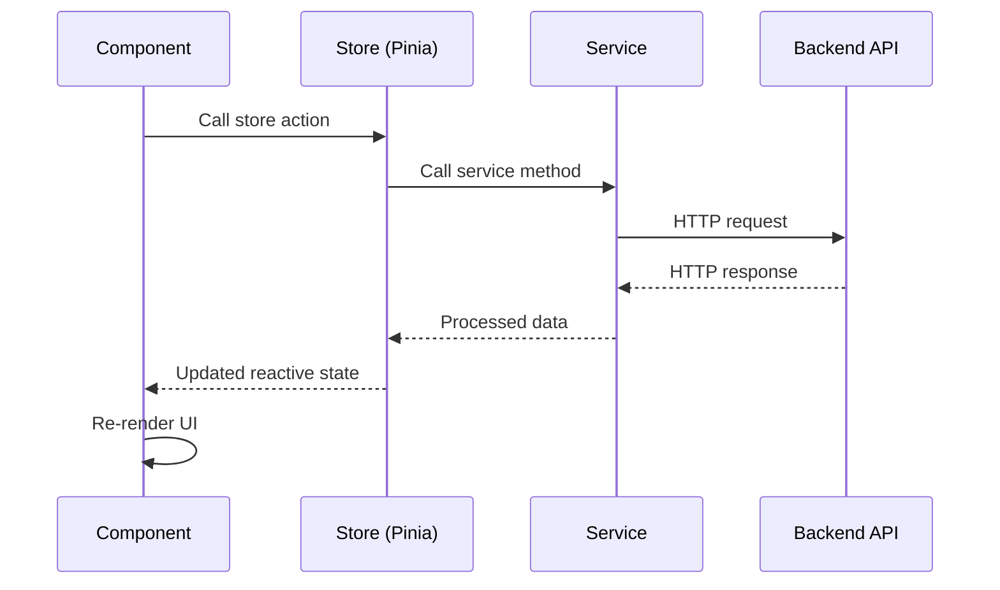
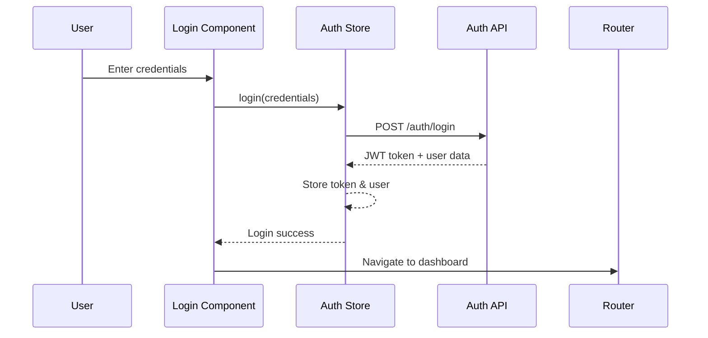

# 🏗️ Frontend Architecture Guide

## Architecture Overview

The Maersk Container Tracking frontend follows a **modern Vue.js 3 architecture** with **TypeScript**, implementing clean separation of concerns, reactive state management, and component-based design principles.

## 🏛️ High-Level Architecture

```mermaid
graph TB
    subgraph "Presentation Layer"
        C[Vue Components]
        V[Views/Pages]
        R[Router]
    end
    
    subgraph "State Management"
        P[Pinia Stores]
        S[State Persistence]
    end
    
    subgraph "Service Layer"
        API[API Services]
        HTTP[HTTP Client (Axios)]
        AUTH[Auth Interceptors]
    end
    
    subgraph "Build & Development"
        VITE[Vite Build Tool]
        TS[TypeScript]
        TW[Tailwind CSS]
    end
    
    C --> P
    V --> C
    R --> V
    P --> API
    API --> HTTP
    HTTP --> AUTH
    
    style C fill:#42b883
    style P fill:#ff6b6b
    style API fill:#4dabf7
    style VITE fill:#646cff
```

## 📁 Project Structure Deep Dive

```
frontend/
├── 📁 public/                     # Static assets served directly
│   ├── favicon.ico               # Application favicon
│   ├── robots.txt               # SEO crawler instructions
│   └── manifest.json            # PWA manifest (if enabled)
├── 📁 src/                       # Source code
│   ├── 📁 components/            # Reusable Vue components
│   │   ├── 📁 common/           # Generic UI components
│   │   │   ├── AppButton.vue    # Button component
│   │   │   ├── AppInput.vue     # Input component
│   │   │   ├── AppModal.vue     # Modal component
│   │   │   ├── DataTable.vue    # Data table component
│   │   │   └── LoadingSpinner.vue
│   │   ├── 📁 forms/            # Form-specific components
│   │   │   ├── ContainerForm.vue
│   │   │   ├── ShipForm.vue
│   │   │   └── BerthAssignmentForm.vue
│   │   ├── 📁 layout/           # Layout components
│   │   │   ├── Sidebar.vue      # Navigation sidebar
│   │   │   ├── Header.vue       # Top header
│   │   │   └── Breadcrumb.vue   # Navigation breadcrumb
│   │   └── 📁 main/             # Main app sections
│   │       ├── BerthCard.vue    # Berth management card
│   │       ├── ContainerCard.vue # Container display card
│   │       └── DashboardCard.vue # Dashboard statistics
│   ├── 📁 views/                 # Page-level components
│   │   ├── DashboardView.vue    # Main dashboard
│   │   ├── LoginView.vue        # Authentication page
│   │   ├── ContainerView.vue    # Container management
│   │   ├── ShipView.vue         # Ship management
│   │   └── BerthView.vue        # Berth operations
│   ├── 📁 stores/                # Pinia state management
│   │   ├── auth.ts              # Authentication state
│   │   ├── containers.ts        # Container management
│   │   ├── ships.ts             # Ship management
│   │   ├── berths.ts            # Berth operations
│   │   └── analytics.ts         # Analytics data
│   ├── 📁 services/              # API service layer
│   │   ├── api.ts               # Axios configuration
│   │   ├── auth.service.ts      # Authentication API
│   │   ├── container.service.ts # Container operations
│   │   ├── ship.service.ts      # Ship operations
│   │   └── berth.service.ts     # Berth operations
│   ├── 📁 types/                 # TypeScript definitions
│   │   ├── auth.ts              # Authentication types
│   │   ├── container.ts         # Container interfaces
│   │   ├── ship.ts              # Ship interfaces
│   │   └── api.ts               # API response types
│   ├── 📁 router/                # Vue Router configuration
│   │   └── index.ts             # Route definitions
│   ├── 📁 assets/                # Static assets
│   │   ├── 📁 css/              # Global styles
│   │   │   └── main.css         # Tailwind imports
│   │   └── 📁 images/           # Image assets
│   ├── 📁 composables/           # Vue composition functions
│   │   ├── useAuth.ts           # Authentication composable
│   │   ├── useApi.ts            # API interaction
│   │   └── useForm.ts           # Form handling
│   ├── 📁 utils/                 # Utility functions
│   │   ├── formatters.ts        # Data formatting
│   │   ├── validators.ts        # Input validation
│   │   └── constants.ts         # Application constants
│   ├── App.vue                  # Root component
│   ├── main.ts                  # Application entry point
│   └── env.d.ts                 # Environment types
├── 📁 .vscode/                   # VS Code configuration
│   ├── settings.json            # Editor settings
│   └── extensions.json          # Recommended extensions
├── .env                         # Environment variables
├── .env.example                 # Environment template
├── index.html                   # HTML entry point
├── package.json                 # Dependencies and scripts
├── vite.config.js               # Vite configuration
├── tailwind.config.js           # Tailwind CSS config
├── tsconfig.json                # TypeScript configuration
└── README.md                    # Frontend documentation
```

## 🔧 Core Technologies & Patterns

### 1. **Vue 3 Composition API**

#### Component Structure:
```vue
<template>
  <!-- Template with TypeScript intellisense -->
  <div class="container-management">
    <AppButton 
      @click="createContainer"
      :loading="isCreating"
    >
      Add Container
    </AppButton>
    
    <DataTable
      :data="containers"
      :columns="columns"
      @row-select="selectContainer"
    />
  </div>
</template>

<script setup lang="ts">
import { ref, computed, onMounted } from 'vue'
import { useContainerStore } from '@/stores/containers'
import { useAuth } from '@/composables/useAuth'
import type { Container } from '@/types/container'

// Props (if any)
interface Props {
  readonly?: boolean
}
const props = withDefaults(defineProps<Props>(), {
  readonly: false
})

// Emits
const emit = defineEmits<{
  containerSelected: [container: Container]
}>()

// Composables
const containerStore = useContainerStore()
const { hasPermission } = useAuth()

// Reactive state
const isCreating = ref(false)
const selectedContainer = ref<Container | null>(null)

// Computed properties
const containers = computed(() => containerStore.containers)
const canCreate = computed(() => hasPermission('container.create'))

// Methods
const createContainer = async () => {
  if (!canCreate.value) return
  
  isCreating.value = true
  try {
    await containerStore.createContainer(containerData)
  } catch (error) {
    console.error('Failed to create container:', error)
  } finally {
    isCreating.value = false
  }
}

// Lifecycle
onMounted(async () => {
  await containerStore.fetchContainers()
})
</script>

<style scoped>
/* Component-specific styles */
.container-management {
  @apply p-6 bg-white rounded-lg shadow-sm;
}
</style>
```

### 2. **TypeScript Integration**

#### Type Definitions (`src/types/`):
```typescript
// types/container.ts
export interface Container {
  id: number
  containerNumber: string
  type: ContainerType
  size: ContainerSize
  weight: number
  cargo?: string
  status: ContainerStatus
  location: string
  portId?: number
  createdAt: string
  updatedAt: string
}

export type ContainerType = 
  | 'Standard' 
  | 'Refrigerated' 
  | 'Tank' 
  | 'Flat Rack'
  | 'Open Top'

export type ContainerSize = '20ft' | '40ft' | '45ft'

export type ContainerStatus = 
  | 'Available' 
  | 'In Transit' 
  | 'At Port' 
  | 'Maintenance'
  | 'Out of Service'

// API Response types
export interface ApiResponse<T> {
  success: boolean
  data: T
  message?: string
  errors?: Record<string, string[]>
}

export interface PaginatedResponse<T> {
  items: T[]
  totalCount: number
  page: number
  pageSize: number
  totalPages: number
}
```

#### Service Layer Types:
```typescript
// types/api.ts
export interface ApiConfig {
  baseURL: string
  timeout: number
  headers?: Record<string, string>
}

export interface RequestOptions {
  params?: Record<string, any>
  headers?: Record<string, string>
  signal?: AbortSignal
}

export interface AuthTokens {
  accessToken: string
  refreshToken?: string
  expiresIn: number
}
```

### 3. **State Management with Pinia**

#### Store Structure:
```typescript
// stores/containers.ts
import { defineStore } from 'pinia'
import { ref, computed } from 'vue'
import { containerService } from '@/services/container.service'
import type { Container, ContainerStatus } from '@/types/container'

export const useContainerStore = defineStore('containers', () => {
  // State
  const containers = ref<Container[]>([])
  const loading = ref(false)
  const error = ref<string | null>(null)
  const selectedContainer = ref<Container | null>(null)

  // Getters (computed)
  const containerCount = computed(() => containers.value.length)
  
  const containersByStatus = computed(() => {
    return containers.value.reduce((acc, container) => {
      const status = container.status
      if (!acc[status]) acc[status] = []
      acc[status].push(container)
      return acc
    }, {} as Record<ContainerStatus, Container[]>)
  })

  const availableContainers = computed(() =>
    containers.value.filter(c => c.status === 'Available')
  )

  // Actions
  const fetchContainers = async (params?: RequestOptions) => {
    loading.value = true
    error.value = null
    
    try {
      const response = await containerService.getAll(params)
      containers.value = response.data.items
    } catch (err) {
      error.value = 'Failed to fetch containers'
      console.error('Fetch containers error:', err)
    } finally {
      loading.value = false
    }
  }

  const createContainer = async (containerData: CreateContainerData) => {
    try {
      const response = await containerService.create(containerData)
      containers.value.push(response.data)
      return response.data
    } catch (err) {
      error.value = 'Failed to create container'
      throw err
    }
  }

  const updateContainer = async (id: number, data: UpdateContainerData) => {
    try {
      const response = await containerService.update(id, data)
      const index = containers.value.findIndex(c => c.id === id)
      if (index !== -1) {
        containers.value[index] = response.data
      }
      return response.data
    } catch (err) {
      error.value = 'Failed to update container'
      throw err
    }
  }

  const deleteContainer = async (id: number) => {
    try {
      await containerService.delete(id)
      const index = containers.value.findIndex(c => c.id === id)
      if (index !== -1) {
        containers.value.splice(index, 1)
      }
    } catch (err) {
      error.value = 'Failed to delete container'
      throw err
    }
  }

  const selectContainer = (container: Container | null) => {
    selectedContainer.value = container
  }

  const clearError = () => {
    error.value = null
  }

  // Reset store state
  const $reset = () => {
    containers.value = []
    loading.value = false
    error.value = null
    selectedContainer.value = null
  }

  return {
    // State
    containers,
    loading,
    error,
    selectedContainer,
    
    // Getters
    containerCount,
    containersByStatus,
    availableContainers,
    
    // Actions
    fetchContainers,
    createContainer,
    updateContainer,
    deleteContainer,
    selectContainer,
    clearError,
    $reset
  }
})
```

### 4. **Service Layer Architecture**

#### HTTP Client Configuration:
```typescript
// services/api.ts
import axios, { 
  AxiosInstance, 
  AxiosRequestConfig, 
  AxiosResponse,
  InternalAxiosRequestConfig
} from 'axios'
import { useAuthStore } from '@/stores/auth'
import type { ApiResponse } from '@/types/api'

class ApiClient {
  private client: AxiosInstance

  constructor() {
    this.client = axios.create({
      baseURL: import.meta.env.VITE_API_BASE_URL || 'http://localhost:5221',
      timeout: 10000,
      headers: {
        'Content-Type': 'application/json',
      },
    })

    this.setupInterceptors()
  }

  private setupInterceptors() {
    // Request interceptor - Add auth token
    this.client.interceptors.request.use(
      (config: InternalAxiosRequestConfig) => {
        const authStore = useAuthStore()
        if (authStore.token) {
          config.headers.Authorization = `Bearer ${authStore.token}`
        }
        return config
      },
      (error) => Promise.reject(error)
    )

    // Response interceptor - Handle errors globally
    this.client.interceptors.response.use(
      (response: AxiosResponse) => response,
      async (error) => {
        const authStore = useAuthStore()
        
        if (error.response?.status === 401) {
          // Token expired or invalid
          await authStore.logout()
          window.location.href = '/login'
        }
        
        return Promise.reject(error)
      }
    )
  }

  // Generic API methods
  async get<T>(url: string, config?: AxiosRequestConfig): Promise<ApiResponse<T>> {
    const response = await this.client.get(url, config)
    return response.data
  }

  async post<T>(url: string, data?: any, config?: AxiosRequestConfig): Promise<ApiResponse<T>> {
    const response = await this.client.post(url, data, config)
    return response.data
  }

  async put<T>(url: string, data?: any, config?: AxiosRequestConfig): Promise<ApiResponse<T>> {
    const response = await this.client.put(url, data, config)
    return response.data
  }

  async delete<T>(url: string, config?: AxiosRequestConfig): Promise<ApiResponse<T>> {
    const response = await this.client.delete(url, config)
    return response.data
  }
}

export const apiClient = new ApiClient()
```

#### Specific Service Implementation:
```typescript
// services/container.service.ts
import { apiClient } from './api'
import type { 
  Container, 
  CreateContainerData, 
  UpdateContainerData, 
  PaginatedResponse 
} from '@/types/container'

class ContainerService {
  private readonly basePath = '/api/containers'

  async getAll(params?: {
    page?: number
    size?: number
    status?: string
    type?: string
    search?: string
  }) {
    return apiClient.get<PaginatedResponse<Container>>(this.basePath, {
      params
    })
  }

  async getById(id: number) {
    return apiClient.get<Container>(`${this.basePath}/${id}`)
  }

  async create(data: CreateContainerData) {
    return apiClient.post<Container>(this.basePath, data)
  }

  async update(id: number, data: UpdateContainerData) {
    return apiClient.put<Container>(`${this.basePath}/${id}`, data)
  }

  async delete(id: number) {
    return apiClient.delete(`${this.basePath}/${id}`)
  }

  async search(query: string) {
    return apiClient.get<Container[]>(`${this.basePath}/search`, {
      params: { q: query }
    })
  }

  async updateStatus(id: number, status: ContainerStatus) {
    return apiClient.put<Container>(`${this.basePath}/${id}/status`, {
      status
    })
  }
}

export const containerService = new ContainerService()
```

### 5. **Vue Router Configuration**

#### Route Structure:
```typescript
// router/index.ts
import { createRouter, createWebHistory, RouteRecordRaw } from 'vue-router'
import { useAuthStore } from '@/stores/auth'

const routes: RouteRecordRaw[] = [
  {
    path: '/login',
    name: 'Login',
    component: () => import('@/views/LoginView.vue'),
    meta: { 
      requiresAuth: false,
      title: 'Login - Maersk Container Tracking'
    }
  },
  {
    path: '/',
    redirect: '/dashboard'
  },
  {
    path: '/dashboard',
    name: 'Dashboard',
    component: () => import('@/views/DashboardView.vue'),
    meta: { 
      requiresAuth: true,
      title: 'Dashboard',
      breadcrumb: [
        { label: 'Dashboard', to: '/dashboard' }
      ]
    }
  },
  {
    path: '/containers',
    name: 'Containers',
    component: () => import('@/views/ContainerView.vue'),
    meta: { 
      requiresAuth: true,
      permissions: ['container.read'],
      title: 'Container Management',
      breadcrumb: [
        { label: 'Dashboard', to: '/dashboard' },
        { label: 'Containers', to: '/containers' }
      ]
    },
    children: [
      {
        path: 'create',
        name: 'CreateContainer',
        component: () => import('@/components/forms/ContainerForm.vue'),
        meta: {
          permissions: ['container.create'],
          title: 'Create Container'
        }
      },
      {
        path: ':id/edit',
        name: 'EditContainer',
        component: () => import('@/components/forms/ContainerForm.vue'),
        props: true,
        meta: {
          permissions: ['container.update'],
          title: 'Edit Container'
        }
      }
    ]
  },
  {
    path: '/berths',
    name: 'BerthOperations',
    component: () => import('@/views/BerthView.vue'),
    meta: {
      requiresAuth: true,
      permissions: ['berth.read'],
      title: 'Berth Operations',
      breadcrumb: [
        { label: 'Dashboard', to: '/dashboard' },
        { label: 'Berth Operations', to: '/berths' }
      ]
    }
  },
  {
    path: '/:pathMatch(.*)*',
    name: 'NotFound',
    component: () => import('@/views/NotFoundView.vue'),
    meta: { 
      title: '404 - Page Not Found'
    }
  }
]

const router = createRouter({
  history: createWebHistory(import.meta.env.BASE_URL),
  routes,
  scrollBehavior(to, from, savedPosition) {
    if (savedPosition) {
      return savedPosition
    } else {
      return { top: 0 }
    }
  }
})

// Global navigation guards
router.beforeEach(async (to, from, next) => {
  const authStore = useAuthStore()

  // Set page title
  document.title = to.meta.title 
    ? `${to.meta.title} - Maersk Container Tracking`
    : 'Maersk Container Tracking'

  // Check authentication
  if (to.meta.requiresAuth && !authStore.isAuthenticated) {
    next('/login')
    return
  }

  // Check permissions
  if (to.meta.permissions && !authStore.hasPermissions(to.meta.permissions)) {
    next('/dashboard') // Redirect to dashboard if no permission
    return
  }

  // Redirect authenticated users from login page
  if (to.name === 'Login' && authStore.isAuthenticated) {
    next('/dashboard')
    return
  }

  next()
})

export default router
```

## 🔄 Data Flow Architecture

### 1. **Component → Store → Service → API**


### 2. **Authentication Flow**


## 🎨 Styling Architecture

### 1. **Tailwind CSS Configuration**
```javascript
// tailwind.config.js
export default {
  content: [
    "./index.html",
    "./src/**/*.{vue,js,ts,jsx,tsx}",
  ],
  theme: {
    extend: {
      colors: {
        // Brand colors
        primary: {
          50: '#eff6ff',
          100: '#dbeafe',
          200: '#bfdbfe',
          300: '#93c5fd',
          400: '#60a5fa',
          500: '#3b82f6', // Main primary
          600: '#2563eb',
          700: '#1d4ed8',
          800: '#1e40af',
          900: '#1e3a8a',
        },
        // Maersk brand colors
        maersk: {
          blue: '#00A3E0',
          navy: '#003F7F',
          gray: '#6B7280',
          light: '#F8FAFC'
        },
        // Status colors
        success: '#10B981',
        warning: '#F59E0B',
        error: '#EF4444',
        info: '#3B82F6'
      },
      fontFamily: {
        sans: ['Inter', 'system-ui', 'sans-serif'],
        mono: ['JetBrains Mono', 'Consolas', 'monospace']
      },
      spacing: {
        '18': '4.5rem',
        '88': '22rem'
      },
      animation: {
        'fade-in': 'fadeIn 0.5s ease-in-out',
        'slide-up': 'slideUp 0.3s ease-out'
      }
    },
  },
  plugins: [
    require('@tailwindcss/forms'),
    require('@tailwindcss/typography'),
    require('@tailwindcss/aspect-ratio'),
  ],
}
```

### 2. **CSS Architecture**
```css
/* assets/css/main.css */

/* Tailwind directives */
@tailwind base;
@tailwind components;
@tailwind utilities;

/* Base styles */
@layer base {
  html {
    @apply scroll-smooth;
  }
  
  body {
    @apply font-sans text-gray-900 bg-gray-50;
  }
  
  h1, h2, h3, h4, h5, h6 {
    @apply font-semibold text-gray-900;
  }
}

/* Component styles */
@layer components {
  .btn-base {
    @apply inline-flex items-center justify-center px-4 py-2 border border-transparent text-sm font-medium rounded-md focus:outline-none focus:ring-2 focus:ring-offset-2 transition-all duration-200;
  }
  
  .btn-primary {
    @apply btn-base bg-primary-600 text-white hover:bg-primary-700 focus:ring-primary-500;
  }
  
  .card {
    @apply bg-white rounded-lg shadow-sm border border-gray-200 p-6;
  }
  
  .form-input {
    @apply block w-full rounded-md border-gray-300 shadow-sm focus:border-primary-500 focus:ring-primary-500;
  }
}

/* Utility classes */
@layer utilities {
  .animate-fade-in {
    animation: fadeIn 0.5s ease-in-out;
  }
  
  .text-shadow {
    text-shadow: 0 1px 3px rgba(0, 0, 0, 0.1);
  }
}

/* Animations */
@keyframes fadeIn {
  from { opacity: 0; transform: translateY(10px); }
  to { opacity: 1; transform: translateY(0); }
}

@keyframes slideUp {
  from { transform: translateY(100%); }
  to { transform: translateY(0); }
}
```

## 🧩 Composables Architecture

### Authentication Composable:
```typescript
// composables/useAuth.ts
import { computed } from 'vue'
import { useAuthStore } from '@/stores/auth'
import { useRouter } from 'vue-router'

export function useAuth() {
  const authStore = useAuthStore()
  const router = useRouter()

  const user = computed(() => authStore.user)
  const isAuthenticated = computed(() => authStore.isAuthenticated)
  const userRole = computed(() => authStore.user?.role)

  const login = async (credentials: LoginCredentials) => {
    try {
      await authStore.login(credentials)
      router.push('/dashboard')
    } catch (error) {
      throw error
    }
  }

  const logout = async () => {
    await authStore.logout()
    router.push('/login')
  }

  const hasPermission = (permission: string): boolean => {
    return authStore.hasPermission(permission)
  }

  const hasRole = (role: string): boolean => {
    return authStore.user?.role === role
  }

  const hasAnyRole = (roles: string[]): boolean => {
    return roles.includes(authStore.user?.role || '')
  }

  return {
    user,
    isAuthenticated,
    userRole,
    login,
    logout,
    hasPermission,
    hasRole,
    hasAnyRole
  }
}
```

## 📊 Performance Optimizations

### 1. **Code Splitting & Lazy Loading**
```typescript
// Lazy load routes
const routes = [
  {
    path: '/containers',
    component: () => import('@/views/ContainerView.vue') // Lazy loaded
  }
]

// Lazy load components
const AsyncComponent = defineAsyncComponent({
  loader: () => import('@/components/HeavyComponent.vue'),
  loadingComponent: LoadingSpinner,
  errorComponent: ErrorComponent,
  delay: 200,
  timeout: 3000
})
```

### 2. **Reactive Performance**
```typescript
// Use shallowRef for large datasets
import { shallowRef } from 'vue'

const largeDataset = shallowRef([])

// Use readonly for immutable data
const config = readonly({
  apiUrl: 'https://api.example.com',
  timeout: 5000
})

// Optimize computed properties
const expensiveComputation = computed(() => {
  // Use memoization or caching for expensive operations
  return heavyCalculation(props.data)
})
```

### 3. **Bundle Optimization**
```javascript
// vite.config.js
export default defineConfig({
  build: {
    rollupOptions: {
      output: {
        manualChunks: {
          vendor: ['vue', 'vue-router', 'pinia'],
          ui: ['lucide-vue-next', '@headlessui/vue'],
          utils: ['axios', 'date-fns']
        }
      }
    }
  }
})
```

## 🔒 Security Architecture

### 1. **Input Sanitization**
```typescript
// utils/sanitization.ts
export const sanitizeInput = (input: string): string => {
  return input
    .trim()
    .replace(/[<>]/g, '') // Remove potential HTML tags
    .substring(0, 1000) // Limit length
}

export const validateContainerNumber = (number: string): boolean => {
  const regex = /^[A-Z]{4}[0-9]{7}$/
  return regex.test(number)
}
```

### 2. **XSS Prevention**
```vue
<template>
  <!-- Use text interpolation instead of v-html when possible -->
  <div>{{ userContent }}</div>
  
  <!-- When HTML is needed, sanitize it -->
  <div v-html="sanitizedHTML"></div>
</template>

<script setup lang="ts">
import DOMPurify from 'dompurify'

const sanitizedHTML = computed(() => 
  DOMPurify.sanitize(rawHTML.value)
)
</script>
```

## 🧪 Testing Architecture

### Component Testing:
```typescript
// components/__tests__/ContainerCard.spec.ts
import { mount } from '@vue/test-utils'
import { createPinia } from 'pinia'
import ContainerCard from '@/components/main/ContainerCard.vue'

describe('ContainerCard', () => {
  let wrapper: any
  let pinia: any

  beforeEach(() => {
    pinia = createPinia()
    wrapper = mount(ContainerCard, {
      global: {
        plugins: [pinia]
      },
      props: {
        container: {
          id: 1,
          containerNumber: 'TEST123456',
          status: 'Available'
        }
      }
    })
  })

  it('displays container information correctly', () => {
    expect(wrapper.text()).toContain('TEST123456')
    expect(wrapper.find('[data-testid="status"]').text()).toBe('Available')
  })
})
```

This comprehensive frontend architecture ensures maintainability, scalability, and follows Vue.js 3 best practices while providing excellent developer experience and user performance.