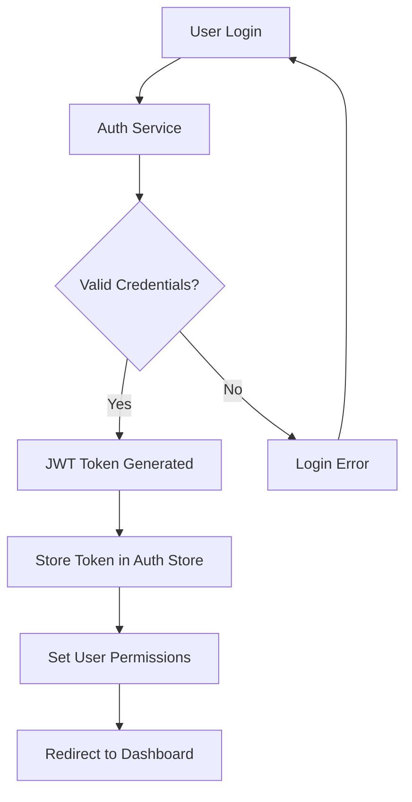

# Frontend Architecture Overview

This document provides a comprehensive overview of the **PortTrack Container Operations** frontend architecture, built with Vue 3, TypeScript, and modern web technologies.

## 🏗️ Architecture Overview

### High-Level Architecture
```
┌─────────────────────────────────────────────────────────────┐
│                    Frontend Application                     │
├─────────────────────────────────────────────────────────────┤
│  Presentation Layer (Vue Components)                       │
│  ├── Page Components (Dashboard, Admin, Management)        │
│  ├── Form Components (Auth, Container, Ship Forms)         │
│  └── UI Components (Navbar, Cards, Modals)                 │
├─────────────────────────────────────────────────────────────┤
│  State Management Layer (Pinia Stores)                     │
│  ├── Auth Store (User, Roles, Permissions)                 │
│  ├── Container Store (Container Data, Operations)          │
│  ├── Port Store (Port Data, Berth Management)              │
│  └── UI Store (Global UI State, Notifications)             │
├─────────────────────────────────────────────────────────────┤
│  Service Layer (API Communication)                         │
│  ├── HTTP Client (Axios with Interceptors)                 │
│  ├── API Services (Auth, Container, Port, Ship)            │
│  └── Utility Services (Storage, Validation, Utils)         │
├─────────────────────────────────────────────────────────────┤
│  Routing Layer (Vue Router)                                │
│  ├── Route Guards (Authentication, Authorization)          │
│  ├── Dynamic Routes (Role-based Routing)                   │
│  └── Lazy Loading (Code Splitting)                         │
└─────────────────────────────────────────────────────────────┘
                              │
                              ▼
┌─────────────────────────────────────────────────────────────┐
│                    Backend API Layer                        │
│  ASP.NET Core Web API with JWT Authentication              │
└─────────────────────────────────────────────────────────────┘
```

## 📁 Project Structure

### Directory Organization
```
frontend/
├── public/                     # Static assets
│   ├── favicon.ico
│   └── assets/
├── src/
│   ├── components/            # Vue Components
│   │   ├── Dashboard.vue         # Main dashboard view
│   │   ├── ContainerManagement.vue # Container operations
│   │   ├── AdminDashboard.vue    # Admin-specific dashboard
│   │   ├── AdminPanel.vue        # Admin panel interface
│   │   ├── PortOperationManagement.vue # Port operations
│   │   ├── EventStreaming.vue    # Real-time events
│   │   ├── Navbar.vue           # Navigation component
│   │   ├── Home.vue             # Landing page
│   │   ├── AccountSettings.vue   # User account management
│   │   ├── ChangePassword.vue    # Password change form
│   │   ├── RoleApplication.vue   # Role request interface
│   │   └── MyRoleApplications.vue # User's role applications
│   ├── forms/                 # Form Components
│   │   └── [Authentication & Data Entry Forms]
│   ├── router/                # Vue Router Configuration
│   │   ├── index.ts              # Main router setup
│   │   ├── guards.ts             # Route guards
│   │   └── routes.ts             # Route definitions
│   ├── services/              # API Services
│   │   ├── api.ts                # Axios configuration
│   │   ├── authService.ts        # Authentication API
│   │   ├── containerService.ts   # Container operations API
│   │   ├── portService.ts        # Port operations API
│   │   ├── shipService.ts        # Ship management API
│   │   └── userService.ts        # User management API
│   ├── stores/                # Pinia State Management
│   │   ├── authStore.ts          # Authentication state
│   │   ├── containerStore.ts     # Container data state
│   │   ├── portStore.ts          # Port operations state
│   │   ├── shipStore.ts          # Ship management state
│   │   └── uiStore.ts            # UI state (modals, notifications)
│   ├── assets/                # Assets
│   │   ├── styles/               # Global styles
│   │   ├── images/               # Images and icons
│   │   └── fonts/                # Custom fonts
│   ├── types/                 # TypeScript Definitions
│   │   ├── api.ts                # API response types
│   │   ├── auth.ts               # Authentication types
│   │   ├── container.ts          # Container data types
│   │   └── common.ts             # Common types
│   ├── utils/                 # Utility Functions
│   │   ├── constants.ts          # Application constants
│   │   ├── helpers.ts            # Helper functions
│   │   └── validators.ts         # Form validation
│   ├── App.vue               # Root component
│   ├── main.ts               # Application entry point
│   └── test-forms.vue        # Development testing component
├── .env                       # Environment variables
├── package.json              # Dependencies and scripts
├── vite.config.js            # Vite configuration
├── jsconfig.json             # JavaScript configuration
└── tailwind.config.js        # Tailwind CSS configuration
```

## 🔧 Technology Stack

### Core Technologies
- **Vue 3.5.22**: Progressive JavaScript framework with Composition API
- **TypeScript**: Static type checking via .vue Single File Components
- **Vite 7.1.7**: Fast build tool and development server
- **Vue Router 4.5.1**: Official routing library for Vue.js

### Styling & UI
- **Tailwind CSS 4.1.13**: Utility-first CSS framework
- **Lucide Vue Next 0.544.0**: Modern icon library
- **Responsive Design**: Mobile-first approach

### State Management & API
- **Pinia**: Official state management for Vue 3
- **Axios 1.12.2**: HTTP client for API communication
- **JWT Authentication**: Token-based authentication system

### Development Tools
- **Vite Plugin Vue DevTools**: Enhanced development experience
- **Hot Module Replacement**: Instant updates during development
- **TypeScript Support**: Built-in type checking

## 🚦 Application Flow

### Authentication Flow


### Role-Based Routing
```typescript
// Role-based route protection
const routes = [
  {
    path: '/admin',
    component: AdminDashboard,
    meta: { requiresAuth: true, roles: ['Admin'] }
  },
  {
    path: '/port-management',
    component: PortOperationManagement,
    meta: { requiresAuth: true, roles: ['Admin', 'PortManager'] }
  },
  {
    path: '/containers',
    component: ContainerManagement,
    meta: { requiresAuth: true, roles: ['Admin', 'PortManager', 'Operator'] }
  },
  {
    path: '/dashboard',
    component: Dashboard,
    meta: { requiresAuth: true } // All authenticated users
  }
]
```

### Data Flow Pattern
```
┌──────────────┐    ┌──────────────┐    ┌──────────────┐
│   Component  │───▶│  Pinia Store │───▶│ API Service  │
│   (Vue SFC)  │    │   (State)    │    │  (Axios)     │
└──────────────┘    └──────────────┘    └──────────────┘
        ▲                    ▲                    │
        │                    │                    ▼
        │                    │           ┌──────────────┐
        │                    └───────────│ Backend API  │
        │                                │ (ASP.NET)    │
        │                                └──────────────┘
        │                                        │
        └────────────────────────────────────────┘
```

## 🏪 State Management Architecture

### Pinia Store Structure
```typescript
// Auth Store Example
export const useAuthStore = defineStore('auth', {
  state: () => ({
    user: null as User | null,
    token: localStorage.getItem('token') || null,
    permissions: [] as string[],
    isLoading: false
  }),

  getters: {
    isAuthenticated: (state) => !!state.token,
    hasRole: (state) => (role: string) => state.user?.roles?.includes(role),
    hasPermission: (state) => (permission: string) => 
      state.permissions.includes(permission)
  },

  actions: {
    async login(credentials: LoginCredentials) {
      this.isLoading = true
      try {
        const response = await authService.login(credentials)
        this.setUser(response.user)
        this.setToken(response.token)
        this.setPermissions(response.permissions)
      } finally {
        this.isLoading = false
      }
    },

    logout() {
      this.user = null
      this.token = null
      this.permissions = []
      localStorage.removeItem('token')
      router.push('/login')
    }
  }
})
```

### Store Communication Pattern
```typescript
// Cross-store communication
export const useContainerStore = defineStore('container', () => {
  const authStore = useAuthStore()
  
  const fetchContainers = async () => {
    // Use auth store to check permissions
    if (!authStore.hasPermission('view_containers')) {
      throw new Error('Insufficient permissions')
    }
    
    // Fetch data with authenticated request
    const response = await containerService.getContainers()
    containers.value = response.data
  }
})
```

## 🛠️ Service Layer Architecture

### API Service Structure
```typescript
// Base API Configuration
const apiClient = axios.create({
  baseURL: import.meta.env.VITE_API_BASE_URL,
  timeout: 10000,
  headers: {
    'Content-Type': 'application/json'
  }
})

// Request Interceptor (Add Auth Token)
apiClient.interceptors.request.use(
  (config) => {
    const token = localStorage.getItem('token')
    if (token) {
      config.headers.Authorization = `Bearer ${token}`
    }
    return config
  },
  (error) => Promise.reject(error)
)

// Response Interceptor (Handle Errors)
apiClient.interceptors.response.use(
  (response) => response,
  (error) => {
    if (error.response?.status === 401) {
      // Handle unauthorized access
      const authStore = useAuthStore()
      authStore.logout()
    }
    return Promise.reject(error)
  }
)
```

### Service Implementation Pattern
```typescript
// Container Service Example
export const containerService = {
  async getContainers(filters?: ContainerFilters): Promise<Container[]> {
    const response = await apiClient.get('/containers', { params: filters })
    return response.data
  },

  async getContainer(id: string): Promise<Container> {
    const response = await apiClient.get(`/containers/${id}`)
    return response.data
  },

  async createContainer(data: CreateContainerData): Promise<Container> {
    const response = await apiClient.post('/containers', data)
    return response.data
  },

  async updateContainer(id: string, data: UpdateContainerData): Promise<Container> {
    const response = await apiClient.put(`/containers/${id}`, data)
    return response.data
  },

  async deleteContainer(id: string): Promise<void> {
    await apiClient.delete(`/containers/${id}`)
  }
}
```

## 🔐 Security Architecture

### Authentication Security
- **JWT Token Storage**: Secure token storage in localStorage
- **Token Expiration**: Automatic token refresh and expiration handling
- **Route Guards**: Authentication and authorization checks
- **API Interceptors**: Automatic token attachment and error handling

### Role-Based Access Control (RBAC)
```typescript
// Permission checking at component level
const canEdit = computed(() => {
  return authStore.hasRole('Admin') || 
         authStore.hasRole('PortManager') ||
         (authStore.hasRole('Operator') && authStore.hasPermission('edit_containers'))
})

// Template-level permission checking
<template>
  <button v-if="canEdit" @click="editContainer">
    Edit Container
  </button>
</template>
```

## 📱 Responsive Design Architecture

### Breakpoint Strategy
```css
/* Tailwind CSS Breakpoints */
sm:  640px  /* Small devices */
md:  768px  /* Medium devices */
lg:  1024px /* Large devices */
xl:  1280px /* Extra large devices */
2xl: 1536px /* 2X large devices */
```

### Component Responsiveness
```vue
<template>
  <!-- Mobile-first responsive grid -->
  <div class="grid grid-cols-1 sm:grid-cols-2 lg:grid-cols-3 xl:grid-cols-4 gap-4">
    <!-- Container cards -->
  </div>
  
  <!-- Responsive navigation -->
  <nav class="hidden md:flex md:space-x-4">
    <!-- Desktop navigation -->
  </nav>
  
  <nav class="md:hidden">
    <!-- Mobile navigation -->
  </nav>
</template>
```

## 🚀 Performance Optimizations

### Code Splitting
```typescript
// Lazy loading of components
const AdminDashboard = defineAsyncComponent(() => import('./AdminDashboard.vue'))
const ContainerManagement = defineAsyncComponent(() => import('./ContainerManagement.vue'))

// Route-based code splitting
const routes = [
  {
    path: '/admin',
    component: () => import('./views/AdminDashboard.vue')
  }
]
```

### Bundle Optimization
- **Tree Shaking**: Unused code elimination via Vite
- **Dynamic Imports**: Component and route-based code splitting
- **Asset Optimization**: Image and font optimization
- **CSS Purging**: Unused CSS removal with Tailwind

## 📊 Monitoring & Analytics

### Error Handling
```typescript
// Global error handling
app.config.errorHandler = (error, instance, info) => {
  console.error('Global error:', error, info)
  // Send to monitoring service
}

// Store error handling
export const useErrorStore = defineStore('error', {
  state: () => ({
    errors: [] as AppError[]
  }),
  
  actions: {
    addError(error: AppError) {
      this.errors.push(error)
      // Log to external service
    }
  }
})
```

## 🔄 Development Workflow

### Local Development
1. **Start Development Server**: `npm run dev`
2. **Hot Reload**: Automatic component updates
3. **TypeScript Checking**: Real-time type validation
4. **API Proxy**: Development API proxying via Vite

### Build Process
1. **Type Checking**: TypeScript validation
2. **Code Splitting**: Automatic chunk splitting
3. **Asset Optimization**: Image and CSS optimization
4. **Bundle Analysis**: Size analysis and optimization

---

This architecture provides a scalable, maintainable, and performant foundation for the PortTrack Container Operations frontend application, supporting role-based access control and real-time container tracking capabilities.