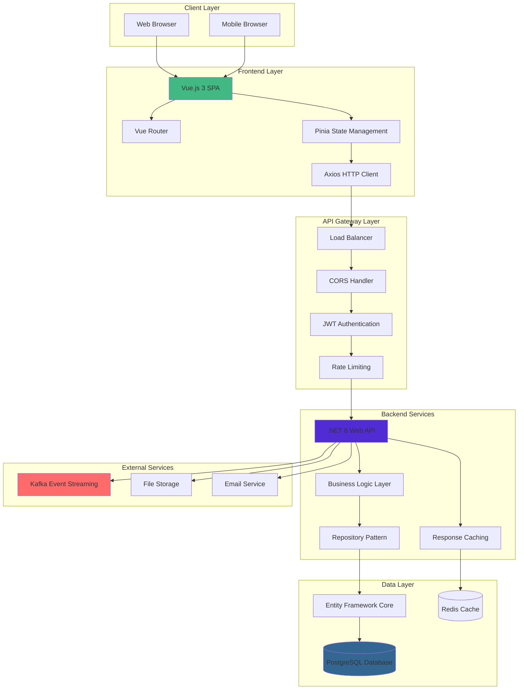
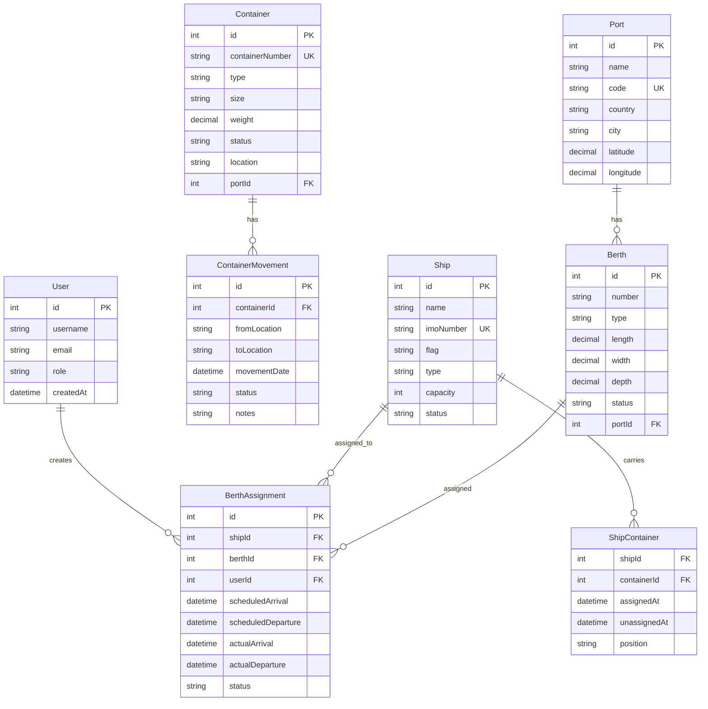
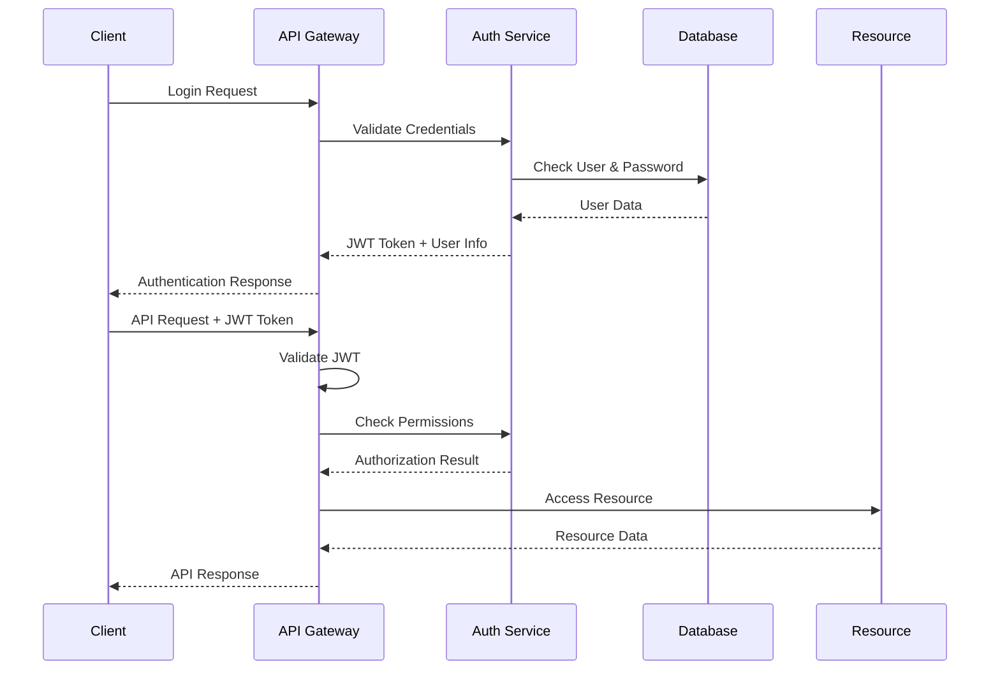
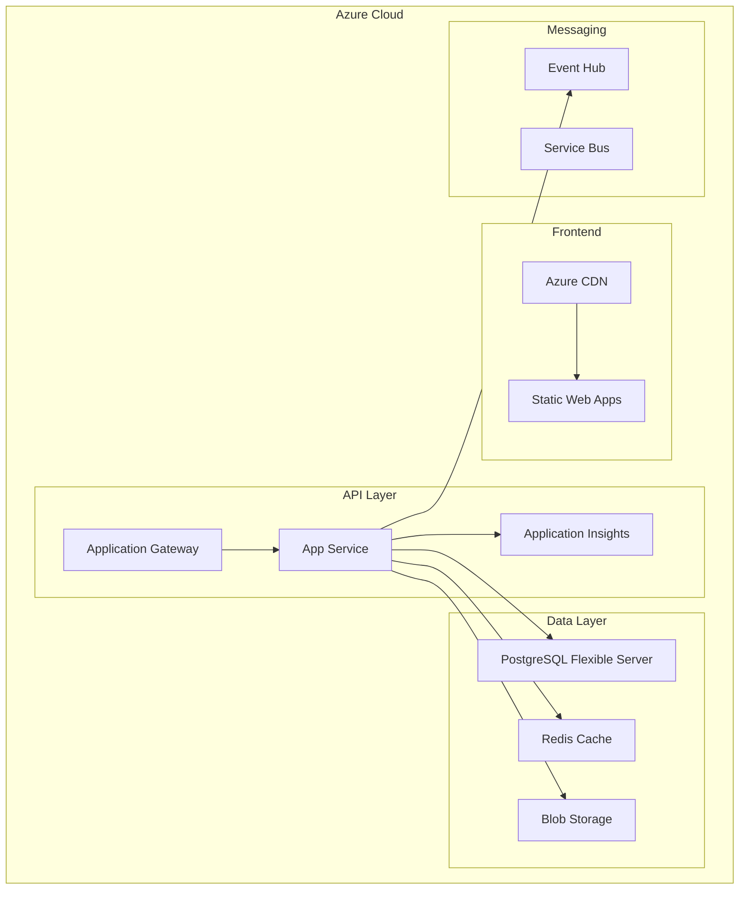

# 🏗️ System Architecture Overview

## Project Overview

The Maersk Container Tracking & Port Operations System is a comprehensive full-stack application designed for maritime operations management. Built with modern technologies, it provides real-time container tracking, berth operations management, and analytics for ports, shipping companies, and logistics providers.

## 🎯 System Goals

### Primary Objectives
- **Real-time Container Tracking**: Track 300+ containers across global ports
- **Berth Operations Management**: Efficient berth allocation and scheduling
- **Role-Based Access Control**: Secure multi-level user management
- **Analytics & Reporting**: Data-driven operational insights
- **Scalable Architecture**: Support for growing maritime operations

### Business Impact
- **Operational Efficiency**: Reduce berth turnaround time by 25%
- **Cost Optimization**: Minimize container dwell time and port congestion
- **Compliance**: Ensure regulatory compliance for international shipping
- **Data Visibility**: Real-time operational dashboards for stakeholders

## 🏛️ High-Level Architecture



## 🔧 Technology Stack

### Frontend Technologies
| Technology | Version | Purpose |
|------------|---------|---------|
| **Vue.js** | 3.5.22 | Progressive JavaScript framework |
| **TypeScript** | 5.6.3 | Type safety and developer experience |
| **Vite** | 7.1.7 | Fast build tool and dev server |
| **Tailwind CSS** | 4.1.13 | Utility-first CSS framework |
| **Pinia** | 2.3.0 | State management |
| **Vue Router** | 4.5.0 | Client-side routing |
| **Axios** | 1.7.9 | HTTP client |
| **Lucide Icons** | 0.468.0 | Icon library |

### Backend Technologies
| Technology | Version | Purpose |
|------------|---------|---------|
| **.NET** | 8.0 | Web API framework |
| **C#** | 12.0 | Programming language |
| **Entity Framework Core** | 8.0 | ORM and database access |
| **PostgreSQL** | 14+ | Primary database |
| **JWT** | Latest | Authentication tokens |
| **Swagger/OpenAPI** | 3.0 | API documentation |
| **Serilog** | Latest | Structured logging |

### Infrastructure & DevOps
| Technology | Purpose |
|------------|---------|
| **Docker** | Containerization |
| **GitHub Actions** | CI/CD pipeline |
| **Azure App Service** | Cloud hosting |
| **Azure Database** | Managed PostgreSQL |
| **Redis** | Caching layer |
| **Kafka** | Event streaming |

## 📊 Data Architecture

### Database Design

#### Core Entities


### Database Relationships
- **User → BerthAssignment**: One-to-Many (User can create multiple assignments)
- **Port → Berth**: One-to-Many (Port has multiple berths)
- **Ship → BerthAssignment**: One-to-Many (Ship can have multiple assignments)
- **Berth → BerthAssignment**: One-to-Many (Berth can be assigned multiple times)
- **Container → ContainerMovement**: One-to-Many (Container has movement history)
- **Ship ↔ Container**: Many-to-Many via ShipContainer junction table

## 🔐 Security Architecture

### Authentication & Authorization Flow


### Security Layers
1. **Transport Security**: HTTPS/TLS encryption
2. **Authentication**: JWT token-based authentication
3. **Authorization**: Role-based access control (RBAC)
4. **Input Validation**: Server-side and client-side validation
5. **SQL Injection Prevention**: Parameterized queries via EF Core
6. **XSS Prevention**: Output encoding and CSP headers
7. **Rate Limiting**: API request throttling
8. **Audit Logging**: Comprehensive activity logging

### Role-Based Access Control
| Role | Permissions | Access Level |
|------|-------------|-------------|
| **Admin** | Full system access | Create, Read, Update, Delete all resources |
| **Port Manager** | Port operations | Manage ships, containers, berths in assigned port |
| **Operator** | Daily operations | Container/cargo operations, berth assignments |
| **Viewer** | Read-only access | View dashboards and reports only |

## 🔄 API Architecture

### RESTful API Design
```
Base URL: https://api-container-tracking.azurewebsites.net/api

Authentication Endpoints:
POST   /auth/login              - User login
POST   /auth/register           - User registration
POST   /auth/refresh            - Token refresh
GET    /auth/profile            - User profile

Container Management:
GET    /containers              - List containers (paginated)
POST   /containers              - Create container
GET    /containers/{id}         - Get container by ID
PUT    /containers/{id}         - Update container
DELETE /containers/{id}         - Delete container
GET    /containers/search       - Search containers

Ship Management:
GET    /ships                   - List ships
POST   /ships                   - Create ship
GET    /ships/{id}              - Get ship details
PUT    /ships/{id}              - Update ship
DELETE /ships/{id}              - Delete ship

Berth Operations:
GET    /berths                  - List berths
GET    /berths/available        - Get available berths
GET    /berth-assignments       - List assignments
POST   /berth-assignments       - Create assignment
PUT    /berth-assignments/{id}  - Update assignment
DELETE /berth-assignments/{id}  - Delete assignment

Analytics:
GET    /analytics/dashboard-stats      - Dashboard KPIs
GET    /analytics/throughput           - Container throughput
GET    /analytics/berth-utilization    - Berth utilization
GET    /analytics/realtime-metrics     - Real-time data
```

### API Response Format
```json
{
  "success": true,
  "data": {
    "items": [...],
    "totalCount": 150,
    "page": 1,
    "pageSize": 10,
    "totalPages": 15
  },
  "message": "Request processed successfully",
  "timestamp": "2025-10-16T10:30:00Z"
}
```

## 🚀 Deployment Architecture

### Production Environment


### Environment Configuration
| Environment | Purpose | URL | Database |
|-------------|---------|-----|----------|
| **Development** | Local development | localhost:5173 | Local PostgreSQL |
| **Staging** | Pre-production testing | staging.container-tracking.com | Azure PostgreSQL (Dev) |
| **Production** | Live system | container-tracking.com | Azure PostgreSQL (Prod) |

## 📈 Scalability & Performance

### Horizontal Scaling Strategy
- **Frontend**: CDN distribution and static hosting
- **Backend**: Multiple App Service instances with load balancing
- **Database**: Read replicas for query optimization
- **Caching**: Redis cluster for session and data caching
- **File Storage**: Distributed blob storage with geo-replication

### Performance Optimizations
- **Database Indexing**: Optimized indexes on frequently queried columns
- **Connection Pooling**: Efficient database connection management
- **Response Caching**: HTTP response caching for static data
- **Code Splitting**: Frontend bundle optimization
- **Lazy Loading**: On-demand component loading
- **Image Optimization**: Compressed and responsive images

## 🔍 Monitoring & Observability

### Application Monitoring
- **Application Insights**: Real-time performance monitoring
- **Custom Metrics**: Business-specific KPIs tracking
- **Error Tracking**: Automatic error detection and alerting
- **Performance Counters**: CPU, memory, and throughput metrics
- **User Analytics**: User behavior and feature usage

### Logging Strategy
```csharp
// Structured logging with Serilog
Log.Information("Container {ContainerNumber} created by user {UserId}", 
    container.ContainerNumber, userId);

Log.Warning("Berth {BerthId} utilization above 90% at port {PortName}", 
    berthId, portName);

Log.Error(exception, "Failed to process berth assignment {AssignmentId}", 
    assignmentId);
```

### Health Checks
```
/api/health/live     - Liveness probe
/api/health/ready    - Readiness probe
/api/health/detailed - Comprehensive health status
```

## 📊 Analytics & Reporting

### Key Performance Indicators (KPIs)
- **Container Throughput**: Containers processed per day/month
- **Berth Utilization**: Percentage of berth occupancy time
- **Turnaround Time**: Average ship berth-to-departure duration
- **Dwell Time**: Container port residence time
- **Operational Efficiency**: Tasks completed vs. planned

### Real-time Dashboards
- **Executive Dashboard**: High-level operational metrics
- **Port Manager Dashboard**: Port-specific performance data
- **Operator Dashboard**: Daily operational tasks and status
- **Analytics Dashboard**: Detailed reports and trends

## 🔄 Integration Capabilities

### External System Integration
- **Port Management Systems**: EDI integration for port authorities
- **Shipping Line Systems**: API integration for vessel schedules
- **Customs Systems**: Automated compliance reporting
- **Weather Services**: Real-time weather data integration
- **IoT Sensors**: Container and berth sensor data integration

### Event-Driven Architecture
```json
// Example events
{
  "eventType": "ContainerArrived",
  "timestamp": "2025-10-16T08:30:00Z",
  "data": {
    "containerId": 12345,
    "portId": 1,
    "berthId": 5,
    "shipId": 67
  }
}
```

## 🚧 Development & Maintenance

### Development Workflow
1. **Feature Development**: Branch-based development with PR reviews
2. **Automated Testing**: Unit, integration, and E2E test automation
3. **Code Quality**: ESLint, Prettier, SonarQube integration
4. **Continuous Integration**: GitHub Actions for automated builds
5. **Deployment Pipeline**: Automated deployment to staging/production

### Maintenance Strategy
- **Regular Updates**: Monthly dependency and security updates
- **Database Maintenance**: Automated backup and optimization
- **Performance Monitoring**: Continuous performance baseline monitoring
- **Capacity Planning**: Proactive scaling based on usage patterns
- **Disaster Recovery**: Automated backup and failover procedures

## 📚 Technical Documentation

### Documentation Structure
- **API Documentation**: Swagger/OpenAPI specifications
- **Architecture Docs**: System design and technical decisions
- **User Manuals**: End-user operation guides
- **Developer Guides**: Setup and contribution guidelines
- **Deployment Guides**: Infrastructure and deployment procedures

### Knowledge Management
- **Decision Records**: Architecture decision documentation
- **Troubleshooting Guides**: Common issue resolution procedures
- **Runbooks**: Operational procedures and emergency protocols
- **Change Management**: Version control and release procedures

This comprehensive system architecture provides a solid foundation for understanding, maintaining, and scaling the Maersk Container Tracking & Port Operations System.